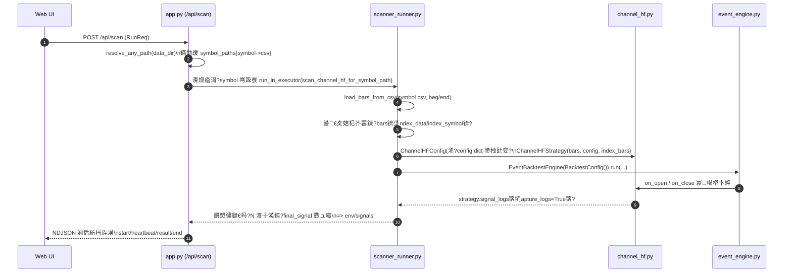
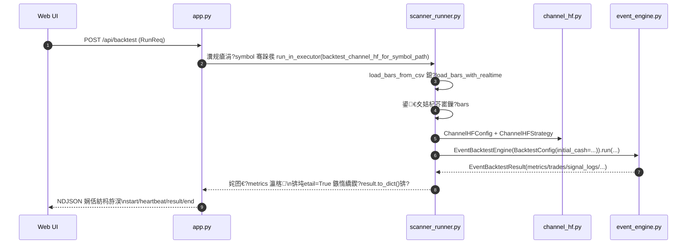
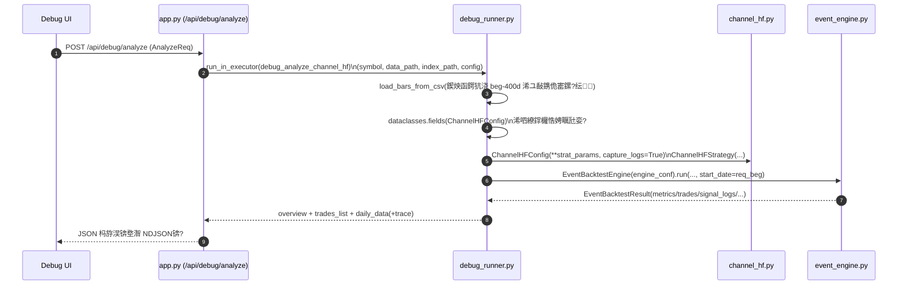

# 椤圭洰鏋舵瀯锛坆and-strategy锛?

鏈枃妗ｆ弿杩板綋鍓嶅伐浣滅洰褰?[band-strategy](file:///f:/Projects/band-strategy) 鐨勬ā鍧楀垝鍒嗐€佽繍琛屾祦绋嬩笌 Python 鏂囦欢鑱岃矗銆?

## 1. 鎬昏

- **褰㈡€?*锛氬崟浣撳簲鐢紙FastAPI Web + 闈欐€佸墠绔?+ 鍥炴祴/鎵弿寮曟搸锛夈€?
- **鏍稿績鑳藉姏**
  - 鎵弿锛氬涓€鎵规爣鐨勬墽琛岀瓥鐣ラ€昏緫锛岃緭鍑烘渶杩戜氦鏄撴棩鐨勪俊鍙?鐜淇℃伅銆?
  - 鍥炴祴锛氫簨浠堕┍鍔ㄥ洖娴嬪紩鎿庯紝杈撳嚭浜ゆ槗鏄庣粏銆佺哗鏁堟寚鏍囦笌鍙€夌殑 debug 鏁版嵁銆?
  - 宸ュ叿閾撅細鏁版嵁璇诲彇/璐ㄩ噺妫€鏌?鏁版嵁鍚屾銆侀€夎偂鍐崇瓥銆侀璁惧弬鏁扮鐞嗙瓑銆?
- **涓昏鍏ュ彛**
  - Web API锛?[app.py](file:///f:/Projects/band-strategy/app.py)
  - CLI锛?[core/__main__.py](file:///f:/Projects/band-strategy/core/__main__.py) 鈫?[core/cli.py](file:///f:/Projects/band-strategy/core/cli.py)

## 2. 鐩綍缁撴瀯

```
band-strategy/
  app.py                # FastAPI 鏈嶅姟绔紙API + 闈欐€佽祫婧愭寕杞?+ 棰勮/閰嶇疆绠＄悊锛?
  core/                 # 鏍稿績鍥炴祴/绛栫暐/鏁版嵁妯″潡锛堝彲琚?CLI 涓?Web API 澶嶇敤锛?
  static_bak/           # 绾潤鎬佸墠绔紙index.html + app.js锛?
  presets/              # 棰勮鍙傛暟锛圝SON锛?
  exports/              # 瀵煎嚭缁撴灉锛堜緥濡?trade_features.json 绛夛級
  validation/           # 鏍￠獙鑴氭湰涓庢姤鍛?
  *.py                  # 鑻ュ共鑴氭湰鍨嬪伐鍏凤紙瀵规帴 API銆佸鐜伴棶棰樸€佺绾挎鏌ョ瓑锛?
```

## 3. 杩愯鏃舵暟鎹祦锛堥珮灞傦級

### 3.1 Web 绔紙娴忚鍣?鈫?FastAPI 鈫?core锛?

- 娴忚鍣ㄥ姞杞介潤鎬侀〉闈細`/static/index.html` + `/static/app.js`
- 鍓嶇閫氳繃 `fetch("/api/...")` 璋冪敤鍚庣鎺ュ彛
- 鍚庣鍦?[app.py](file:///f:/Projects/band-strategy/app.py) 涓細
  - 鍋氬弬鏁版牎楠屻€佽矾寰勮В鏋愩€侀璁捐鍐欍€佷换鍔¤皟搴?
  - 灏嗛噸 CPU 鐨勬壂鎻?鍥炴祴浠诲姟鍒嗗彂鍒?`ProcessPoolExecutor`
  - 璋冪敤 `core/*` 瀹屾垚绛栫暐璁＄畻涓庡洖娴?

### 3.2 CLI锛堝懡浠よ 鈫?core锛?

- 鍏ュ彛锛歚python -m core ...` 鎴栫洿鎺ヨ皟鐢?[core/cli.py](file:///f:/Projects/band-strategy/core/cli.py)
- CLI 鐩存帴璇诲彇 CSV/鐩綍銆佹瀯寤虹瓥鐣ヤ笌鍥炴祴寮曟搸锛岃緭鍑烘枃鏈?JSON 缁撴灉

## 4. 鏍稿績妯″潡鍏崇郴鍥撅紙姒傚康锛?

```
app.py
  鈹溾攢> core/scanner_runner.py  鈹€鈹€> core/channel_hf.py / core/platform_breakout.py
  鈹溾攢> core/debug_runner.py    鈹€鈹€> core/channel_hf.py + debug 瑙ｉ噴/澶嶇洏閫昏緫
  鈹溾攢> core/data.py            鈹€鈹€> CSV 璇诲彇/鍐欏叆 + 鏁版嵁鍚屾/璐ㄩ噺妫€鏌?
  鈹溾攢> core/selector.py        鈹€鈹€> 閫夎偂鍐崇瓥锛堣鍙栧洖娴嬬粨鏋滄枃浠跺仛绛涢€?瑙ｉ噴锛?
  鈹斺攢> core/smart_analyze.py   鈹€鈹€> 鏅鸿兘鍒嗘瀽锛堝澶栭儴 LLM/妯″瀷鐨勫皝瑁咃級

core/event_engine.py
  鈹溾攢> PortfolioBroker锛坈ore/broker.py锛?
  鈹溾攢> Metrics锛坈ore/metrics.py锛?
  鈹斺攢> Strategy锛堝 core/channel_hf.py, core/platform_breakout.py锛?
```

## 5. 閫愭枃浠惰亴璐ｈ鏄庯紙Python锛?

### 5.1 鏍圭洰褰曡剼鏈笌鏈嶅姟

- [app.py](file:///f:/Projects/band-strategy/app.py)
  - FastAPI 鏈嶅姟涓诲叆鍙ｏ細鎸傝浇闈欐€佽祫婧愩€佸畾涔?`/api/*` 璺敱銆?
  - 绠＄悊 `config.json` 涓?`presets/`锛氭彁渚涢璁惧垪琛ㄣ€佷繚瀛樸€佸姞杞姐€佸簲鐢ㄧ瓑鎺ュ彛銆?
  - 缁勭粐鎵弿/鍥炴祴/璋冭瘯/鏁版嵁鍚屾绛夐暱浠诲姟锛堝寘鍚祦寮忚緭鍑烘帴鍙ｏ級銆?
  - 閫氳繃绾跨▼姹?杩涚▼姹犻殧绂?IO 涓?CPU 璁＄畻銆?

- [analyze_results.py](file:///f:/Projects/band-strategy/analyze_results.py)
  - 绂荤嚎鍒嗘瀽鑴氭湰锛氶€氬父鐢ㄤ簬姹囨€绘垨妫€鏌ヨ緭鍑虹粨鏋滐紙鍏蜂綋浠ヨ剼鏈唴瀹逛负鍑嗭級銆?

- [check_current_signals.py](file:///f:/Projects/band-strategy/check_current_signals.py)
  - 绂荤嚎妫€鏌ュ綋鍓嶄俊鍙?鐜鐨勮剼鏈紙渚夸簬蹇€熼獙璇佹煇涓爣鐨勭姸鎬侊級銆?

- [check_index_status.py](file:///f:/Projects/band-strategy/check_index_status.py)
  - 鎸囨暟鐘舵€佹鏌ヨ剼鏈紙鐢ㄤ簬楠岃瘉鎸囨暟纭/鐔婂競璇嗗埆绛夐€昏緫锛夈€?

- [check_vol_ratio.py](file:///f:/Projects/band-strategy/check_vol_ratio.py)
  - 娉㈠姩鐜?閲忚兘鐩稿叧妫€鏌ヨ剼鏈紙鐢ㄤ簬鏍稿 volatility_ratio 鎴?vol_ratio 閫昏緫锛夈€?

- [manage_presets.py](file:///f:/Projects/band-strategy/manage_presets.py)
  - 棰勮绠＄悊鑴氭湰锛氶€氬父鐢ㄤ簬鎵归噺瀵煎叆/瀵煎嚭/鏁寸悊棰勮銆?

- [reproduce_issue.py](file:///f:/Projects/band-strategy/reproduce_issue.py)
  - 澶嶇幇鍘嗗彶闂鐨勮剼鏈紙缁欏畾鍥哄畾杈撳叆锛岃Е鍙戝苟瀹氫綅 bug锛夈€?

- [run_min_backtest.py](file:///f:/Projects/band-strategy/run_min_backtest.py)
  - 鏈€灏忓寲鍥炴祴鑴氭湰锛氱敤浜庡揩閫熻窇閫氬紩鎿?绛栫暐涓绘祦绋嬨€?

- [debug_detailed_check.py](file:///f:/Projects/band-strategy/debug_detailed_check.py)
  - 缁嗙矑搴﹁皟璇曟鏌ヨ剼鏈細閫氬父鍜?debug_runner 鐨勫垎鏋愯緭鍑洪厤鍚堜娇鐢ㄣ€?

- [random_check_20241231.py](file:///f:/Projects/band-strategy/random_check_20241231.py)
  - 涓存椂鎬ч殢鏈烘娊鏍烽獙璇佽剼鏈紙鏂囦欢鍚嶅甫鏃ユ湡锛屽亸涓€娆℃€х敤閫旓級銆?

- [test_batch_api.py](file:///f:/Projects/band-strategy/test_batch_api.py)
  - API 璋冪敤/鎵归噺鎺ュ彛鐨勬祴璇曡剼鏈紙涓嶄緷璧栨祻瑙堝櫒锛岃蛋 HTTP锛夈€?

- [test_smart_ask.py](file:///f:/Projects/band-strategy/test_smart_ask.py)
  - 鏅鸿兘鍒嗘瀽鑳藉姏鐨勬祴璇曡剼鏈紙楠岃瘉 smart_analyze 鐨勮姹?杩斿洖锛夈€?

- [calc_20250102.py](file:///f:/Projects/band-strategy/calc_20250102.py)
  - 璁＄畻/鍒嗘瀽鐨勪复鏃惰剼鏈紙鏂囦欢鍚嶅甫鏃ユ湡锛屽亸涓€娆℃€х敤閫旓級銆?

### 5.2 core/锛堟牳蹇冨簱锛?

- [core/__init__.py](file:///f:/Projects/band-strategy/core/__init__.py)
  - 鍖呭垵濮嬪寲锛堜娇 `core` 鍙瀵煎叆锛夈€?

- [core/__main__.py](file:///f:/Projects/band-strategy/core/__main__.py)
  - CLI 鍏ュ彛锛氳浆鍙戝埌 [core/cli.py](file:///f:/Projects/band-strategy/core/cli.py) 鐨?`main()`銆?

- [core/cli.py](file:///f:/Projects/band-strategy/core/cli.py)
  - 鍛戒护琛屽伐鍏凤細瑙ｆ瀽鍙傛暟銆佽鍙栨暟鎹€佽繍琛岀瓥鐣ヤ笌鍥炴祴銆佽緭鍑虹粨鏋溿€?
  - 璐熻矗鎶婂涓瓙绯荤粺锛堟暟鎹€佸紩鎿庛€佺瓥鐣ワ級涓叉垚鍙墽琛屽懡浠ゃ€?

- [core/types.py](file:///f:/Projects/band-strategy/core/types.py)
  - 鍏ㄥ眬鏁版嵁缁撴瀯/绫诲瀷瀹氫箟锛欿绾?Bar銆佽鍗?Order銆佹垚浜?Fill銆佹寔浠?Position銆佸洖娴嬮厤缃瓑銆?
  - 澶氭ā鍧楀叡浜殑鈥滈鍩熸ā鍨嬧€濄€?

- [core/data.py](file:///f:/Projects/band-strategy/core/data.py)
  - 鏁版嵁灞傦細CSV 璇诲彇/鍐欏叆銆佺洰褰曞姞杞姐€佸彲鑳借繕鍖呭惈澶栭儴鏁版嵁婧愬悓姝ヤ笌璐ㄩ噺妫€鏌ャ€?
  - Web 绔暟鎹悓姝?璐ㄩ噺妫€鏌ユ帴鍙ｄ細鐩存帴璋冪敤杩欓噷鐨勮兘鍔涖€?

- [core/broker.py](file:///f:/Projects/band-strategy/core/broker.py)
  - 鎾悎/璐︽埛锛氳祫閲戙€佹寔浠撱€佹墜缁垂銆佽鍗曟墽琛屻€佷氦鏄撶敓鎴愮瓑銆?
  - `engine.py` 涓?`event_engine.py` 浼氶€氳繃 Broker 鎶借薄缁熶竴澶勭悊浜ゆ槗閫昏緫銆?

- [core/metrics.py](file:///f:/Projects/band-strategy/core/metrics.py)
  - 缁╂晥鎸囨爣锛氭敹鐩婄巼銆佸洖鎾ゃ€佸鏅?绱㈡彁璇?鍗＄帥绛夛紝浠ュ強浜ゆ槗缁熻銆?
  - 琚紩鎿庡眰鍦ㄥ洖娴嬬粨鏉熷悗璋冪敤锛岀敓鎴愮粺涓€鐨勬寚鏍囧璞°€?

- [core/engine.py](file:///f:/Projects/band-strategy/core/engine.py)
  - 鍥炴祴寮曟搸锛堝亸鈥滀俊鍙烽┍鍔?閫?bar 椹卞姩鈥濋鏍硷級锛氱粍缁?Broker銆丼trategy銆丮etrics銆?
  - 杈撳嚭 `BacktestResult`锛堝寘鍚?equity curve銆乫ills銆乷rders銆乵etrics 绛夛級銆?

- [core/event_engine.py](file:///f:/Projects/band-strategy/core/event_engine.py)
  - 浜嬩欢椹卞姩鍥炴祴寮曟搸锛氫互 `MarketFrame`锛堟煇鏃ユ墍鏈夋爣鐨勶級涓哄崟浣嶈Е鍙?`EventStrategy.on_open/on_close`銆?
  - 杈撳嚭 `EventBacktestResult`锛屽苟鏀寔鏇翠赴瀵岀殑鏃ュ織/瑙ｉ噴鎬у瓧娈碉紙signal_logs銆乨ecision_logs銆乿alidation_data 绛夛級銆?

- [core/strategy.py](file:///f:/Projects/band-strategy/core/strategy.py)
  - 澶氱瓥鐣ラ泦鍚堜笌鍩虹被锛氫緥濡傜獊鐮寸瓥鐣ャ€佸潎绾夸氦鍙夌瓥鐣ョ瓑锛堟彁渚?`generate_signal` 绛夎兘鍔涳級銆?
  - 鍖呭惈閮ㄥ垎閫氱敤鐨勬敮鎾?闃诲姏涓庡嚭鍏ュ満瑙勫垯瀹炵幇銆?

- [core/channel_hf.py](file:///f:/Projects/band-strategy/core/channel_hf.py)
  - Channel HF锛堥€氶亾楂橀锛夌瓥鐣ュ疄鐜帮細閫氶亾绾挎嫙鍚堛€佸綊涓€鏂滅巼銆佹樉钁椾綆鐐?pivot 閫夊彇銆侀噺鑳?娉㈠姩鐜囪繃婊ゃ€佹鎹熶笌鐩爣浠风瓑銆?
  - 鍏抽敭绠楁硶闆嗕腑鍦細
    - `_fit_midline()`锛氫腑杞ㄧ嚎鎬ф嫙鍚?
    - `_pick_pivot_low()`锛氭樉钁椾綆鐐归€夋嫨
    - `_get_channel_lines()`锛歮id/lower/upper/slope_norm 绛夐€氶亾鐜杈撳嚭

- [core/indicators.py](file:///f:/Projects/band-strategy/core/indicators.py)
  - 鎶€鏈寚鏍?褰㈡€佸伐鍏凤細濡傛枩鐜囪绠椼€佸钩鍙拌瘑鍒紙find_platform锛夌瓑銆?
  - 澶氱瓥鐣ュ鐢ㄧ殑鈥滄寚鏍囧簱鈥濄€?

- [core/platform_breakout.py](file:///f:/Projects/band-strategy/core/platform_breakout.py)
  - 骞冲彴绐佺牬绛栫暐锛氬钩鍙拌瘑鍒€佺獊鐮村叆鍦恒€佹鎹?绉诲姩姝㈡崯銆侀闄╂帶鍒剁瓑锛岄€氬父閰嶅悎 `Universe/Fundamentals` 鍋氳繃婊ゃ€?

- [core/universe.py](file:///f:/Projects/band-strategy/core/universe.py)
  - 鑲＄エ姹?鐧藉悕鍗曪細鐢ㄤ簬闄愬畾鍙氦鏄撴爣鐨勮寖鍥淬€佹敮鎸佷粠 CSV 鍔犺浇绛夈€?

- [core/fundamentals.py](file:///f:/Projects/band-strategy/core/fundamentals.py)
  - 鍩烘湰闈㈡暟鎹瓨鍌ㄤ笌鏌ヨ锛氫緥濡?PE銆佸競鍊肩瓑瀛楁锛堜緵绛栫暐杩囨护浣跨敤锛夈€?

- [core/scanner_runner.py](file:///f:/Projects/band-strategy/core/scanner_runner.py)
  - Web 鎵弿/鍥炴祴鐨勨€滅紪鎺掑眰鈥濓細
    - 璐熻矗鎶?Web 璇锋眰鐨?`config` 鏄犲皠鎴愬叿浣撶瓥鐣ラ厤缃璞★紙濡?`ChannelHFConfig`銆乣PlatformBreakoutConfig`锛夈€?
    - 璋冪敤 `EventBacktestEngine` 鎵ц锛屽苟灏嗚緭鍑烘暣鐞嗘垚閫傚悎 API 杩斿洖鐨勭粨鏋勩€?
  - 鍏稿瀷琚?[app.py](file:///f:/Projects/band-strategy/app.py) 鐨?`/api/scan`銆乣/api/backtest` 绛夋帴鍙ｈ皟鐢ㄣ€?

- [core/debug_runner.py](file:///f:/Projects/band-strategy/core/debug_runner.py)
  - 璋冭瘯鍒嗘瀽缂栨帓锛氬鍗曟爣鐨勭粰鍑洪€愭杩囨护鍣ㄩ€氳繃/澶辫触鍘熷洜銆佸叧閿幆澧冨€笺€佸鐩樿緭鍑虹瓑銆?
  - 鍏稿瀷琚?[app.py](file:///f:/Projects/band-strategy/app.py) 鐨?`/api/debug/analyze` 璋冪敤銆?

- [core/selector.py](file:///f:/Projects/band-strategy/core/selector.py)
  - 閫夎偂鍐崇瓥妯″潡锛氳鍙栦袱绫诲洖娴嬬粨鏋滄枃浠讹紙渚嬪鈥滀笂杞ㄤ笅绯?涓建涓婄郴鈥濈粨鏋滐級锛屽仛绛涢€変笌瑙ｉ噴杈撳嚭銆?
  - 鍏稿瀷琚?[app.py](file:///f:/Projects/band-strategy/app.py) 鐨?`/api/selector` 璋冪敤銆?

- [core/smart_analyze.py](file:///f:/Projects/band-strategy/core/smart_analyze.py)
  - 鏅鸿兘鍒嗘瀽锛氭妸鈥滄枃浠?+ 闂鈥濆皝瑁呮垚鍙皟鐢ㄧ殑鍒嗘瀽鑳藉姏锛堝綋鍓嶅湪 Web API 涓毚闇蹭负 `/api/smart_analyze`锛夈€?

- [core/batch_runner.py](file:///f:/Projects/band-strategy/core/batch_runner.py)
  - 鎵瑰鐞嗚緟鍔╋細璺緞瑙ｆ瀽銆佹壒閲忚繍琛屽伐鍏峰嚱鏁扮瓑锛堝澶?runner/鑴氭湰澶嶇敤锛夈€?

- [core/analyzer.py](file:///f:/Projects/band-strategy/core/analyzer.py)
  - 鍒嗘瀽鍣細鏇村亸鈥滀俊鍙疯绠?鐜璁＄畻/澶嶇洏杈撳嚭鈥濈殑宸ュ叿灞傦紙甯哥敤浜庣敓鎴?SIG_CONFIG銆佽В閲婃€х粺璁＄瓑锛夈€?

- [core/notification.py](file:///f:/Projects/band-strategy/core/notification.py)
  - 閫氱煡鑳藉姏锛堝灏嗙粨鏋滄帹閫佸埌澶栭儴娓犻亾锛夛紱鐩墠鏇村浣滀负鍙€夋墿灞曠偣銆?

## 6. 鍓嶅悗绔€﹀悎鐐癸紙鍙傛暟涓庡懡鍚嶏級

- 鍓嶇闈欐€侀〉闈㈠湪 [static_bak/index.html](file:///f:/Projects/band-strategy/static_bak/index.html) 瀹氫箟琛ㄥ崟涓庢帶浠躲€?
- 鍓嶇閫昏緫鍦?[static_bak/app.js](file:///f:/Projects/band-strategy/static_bak/app.js)锛?
  - `getStrategyConfigFromUI()` 灏?UI 瀛楁鎷兼垚鍚庣闇€瑕佺殑 JSON锛堟槧灏勫埌 [app.py](file:///f:/Projects/band-strategy/app.py) 鐨?`RunReq`锛夈€?
  - 鎵弿/鍥炴祴绛夋祦绋嬮€氳繃 `/api/scan`銆乣/api/backtest` 绛夋帴鍙ｈЕ鍙戙€?

## 7. 甯歌鎵╁睍鏂瑰紡锛堣惤鐐瑰缓璁級

- 鏂板绛栫暐锛?
  - 鍦?`core/` 鏂板缓绛栫暐瀹炵幇锛堝缓璁户鎵?`EventStrategy`锛夛紝骞跺湪 `core/cli.py` 涓?`core/scanner_runner.py` 澧炲姞缂栨帓鍏ュ彛銆?
- 鏂板鎸囨爣/褰㈡€佸伐鍏凤細
  - 鏀惧埌 [core/indicators.py](file:///f:/Projects/band-strategy/core/indicators.py) 鎴栨媶鍒嗕负鏇寸粏鐨勬ā鍧楋紙淇濇寔绾嚱鏁般€佸彲娴嬭瘯锛夈€?
- 鏂板 Web API锛?
  - 鍦?[app.py](file:///f:/Projects/band-strategy/app.py) 澧炲姞璺敱锛岄伩鍏嶆妸鏍稿績涓氬姟閫昏緫鍐欒繘璺敱鍑芥暟锛屽敖閲忚皟鐢?`core/*`銆?

## 8. 鏁版嵁娴佷笌妯″潡渚濊禆鍥?

鏈妭浠ヤ竴娆″畬鏁寸殑鈥滄壂鎻忥紙/api/scan锛夆€濅笌鈥滃洖娴嬶紙/api/backtest銆?api/backtest_detail锛夆€濅负渚嬶紝璇存槑鏁版嵁鍦?`app.py -> scanner_runner.py -> channel_hf.py -> event_engine.py` 浠ュ強璋冭瘯閾捐矾 `app.py -> debug_runner.py -> channel_hf.py -> event_engine.py` 涔嬮棿濡備綍娴佸姩銆?

### 8.1 妯″潡渚濊禆锛堥潤鎬侊級

```mermaid
flowchart LR
  A[app.py<br/>FastAPI API 灞俔 --> B[core/scanner_runner.py<br/>鎵弿/鍥炴祴缂栨帓]
  A --> C[core/debug_runner.py<br/>鍗曟爣鐨勮皟璇曞垎鏋怾

  B --> D[core/channel_hf.py<br/>ChannelHFStrategy + ChannelHFConfig]
  C --> D

  D --> E[core/event_engine.py<br/>EventBacktestEngine]
  E --> F[core/broker.py<br/>PortfolioBroker]
  E --> G[core/types.py<br/>Bar/Order/Side...]

  B --> H[core/data_loader.py 绛?br/>load_bars_from_csv/...]
  C --> H
  E --> I[core/metrics.py 绛?br/>Metrics/Result]
```

### 8.2 鈥滄壂鎻忊€濊姹傛暟鎹祦锛?api/scan锛?

鍏ュ彛锛歔api_scan](file:///f:/Projects/band-strategy/app.py)  
缂栨帓鍑芥暟锛歔scan_channel_hf_for_symbol_path](file:///f:/Projects/band-strategy/core/scanner_runner.py)



**鍏抽敭鏁版嵁褰㈡€?*

- 璇锋眰浣擄細`RunReq`锛堣 [app.py](file:///f:/Projects/band-strategy/app.py)锛夈€?
- API 鍐呴儴涓存椂鏄犲皠锛歚symbol_paths: dict[str, Path]`锛屾妸鐩綍涓?`*.csv` 鏄犲皠涓烘爣鐨勫垪琛ㄣ€?
- 骞跺彂涓庢祦寮忚緭鍑猴細`/api/scan` 鐢?`StreamingResponse(application/x-ndjson)`锛岄€愯杈撳嚭锛?
  - `{"type":"start","job_id":...,"total":...}`
  - `{"type":"heartbeat","progress":"done/total"}`
  - `{"type":"result","data":{...}}`
  - `{"type":"end"}`
- 鍗曟爣鐨勬壂鎻忕粨鏋滐紙Runner 杩斿洖缁?API锛夛細`{"symbol", "last_date", "env", "signals"}`锛屽叾涓?`env/signals` 鏉ヨ嚜 `ChannelHFStrategy.signal_logs` 鐨勬渶杩戜竴鏉?`final_signal in (1,-1)` 鐨勬棩蹇椼€?

### 8.3 鈥滃洖娴嬧€濊姹傛暟鎹祦锛?api/backtest銆?api/backtest_detail锛?

鍏ュ彛锛?
- 鎵归噺鍥炴祴锛歔api_backtest](file:///f:/Projects/band-strategy/app.py)
- 鍗曟爣鐨勬槑缁嗗洖娴嬶細[api_backtest_detail](file:///f:/Projects/band-strategy/app.py)

缂栨帓鍑芥暟锛歔backtest_channel_hf_for_symbol_path](file:///f:/Projects/band-strategy/core/scanner_runner.py)



**鍥炴祴缁撴灉鍦ㄥ眰闂寸殑鈥滅矑搴﹀樊寮傗€?*

- `/api/backtest`锛堟壒閲忥級榛樿鍙彇 `metrics` 鐨勫叧閿瓧娈电粍瑁呮垚杞婚噺 dict 杩斿洖锛堜緥濡?`total_return/sharpe/trades/anomalies/...`锛夈€?
- `/api/backtest_detail` 浼氬己鍒?`detail=True`锛孯unner 杩斿洖 `result.to_dict()`锛屽寘鍚?`signal_logs/decision_logs/validation_data/trades` 绛夋洿鍏ㄧ殑缁撴瀯銆?

### 8.4 鈥滆皟璇曞垎鏋愨€濊姹傛暟鎹祦锛?api/debug/analyze锛?

鍏ュ彛锛歔api_debug_analyze](file:///f:/Projects/band-strategy/app.py)  
缂栨帓鍑芥暟锛歔debug_analyze_channel_hf](file:///f:/Projects/band-strategy/core/debug_runner.py)



**璋冭瘯閾捐矾涓庢壂鎻?鍥炴祴鐨勫叧閿樊寮?*

- Debug 寮哄埗 `capture_logs=True`锛屽苟鎶?`ChannelHFConfig` 鐨勬湁鏁堝瓧娈典粠 `config dict` 閲岃繃婊ゅ嚭鏉ワ紝閬垮厤鍓嶇浼犲叆鐨勯潪绛栫暐瀛楁姹℃煋绛栫暐鏋勯€犮€?
- Debug 杩斿洖鐨?`daily_data` 浼氭妸姣忎釜浜ゆ槗鏃?OHLCV 涓?`signal_logs` 閲岀殑閫氶亾/杩囨护鍣?trace 鍚堝苟锛屼究浜庡墠绔敾鍥句笌閫愭瑙ｉ噴銆?

### 8.5 寮曟搸鍐呴儴鐨勬暟鎹祦锛堢瓥鐣ュ浣曗€滆椹卞姩鈥濓級

寮曟搸瀹炵幇锛歔EventBacktestEngine.run](file:///f:/Projects/band-strategy/core/event_engine.py)

- 杈撳叆锛歚bars: list[Bar]`锛堝彲鑳藉寘鍚鏍囩殑锛屾寜鏃ユ湡鍒嗘《锛夛紝`strategy: EventStrategy`锛屽彲閫?`benchmark_bars`锛屽彲閫?`start_date`銆?
- 涓诲惊鐜細瀵规瘡涓氦鏄撴棩 `T`锛?
  - 鎵ц `pending_orders[T]`锛堜笂涓€浜ゆ槗鏃ユ敹鐩樺悗鐢熸垚锛孴 鏃ュ紑鐩樻墽琛岋級
  - 璋冪敤 `strategy.on_open(i, frame, broker)`
  - 鐢ㄦ敹鐩樹环 `mark_to_market` 鏇存柊鏉冪泭
  - 璋冪敤 `strategy.on_close(i, frame, broker)` 鐢熸垚璁㈠崟锛岃皟搴﹀埌 `T+1` 寮€鐩樻墽琛?
- 杈撳嚭锛歚EventBacktestResult(metrics/trades/signal_logs/decision_logs/validation_data/data_anomalies)`

### 8.6 鎵归噺娴嬭瘯 / 鎷掔粷鍒嗘瀽 / 鍙傛暟璇存槑 UI锛堝叆鍙ｃ€佹帴鍙ｃ€佹ā鍧楋級

鏈妭浠モ€滄枃妗ｅ紡闂瓟鈥濈殑鏂瑰紡锛岃ˉ榻愪笁鍧楀姛鑳界殑鍓嶅悗绔叆鍙ｄ笌妯″潡钀界偣锛屼究浜庢帓鏌ラ棶棰樹笌浜屾寮€鍙戙€?

#### 8.6.1 鎵归噺娴嬭瘯鍔熻兘锛堝弬鏁扮粍鍚堟壒閲忓洖娴嬶級

**鍓嶇鍏ュ彛**

- URL锛氭湰椤圭洰涓哄崟椤靛簲鐢紝鍏ュ彛缁熶竴涓?`/`锛堣 [index](file:///f:/Projects/band-strategy/app.py#L610-L612) 杩斿洖 [index.html](file:///f:/Projects/band-strategy/static_bak/index.html#L605-L658)锛夛紝鏃犵嫭绔?`/batch_test` 椤甸潰璺敱銆?
- 椤甸潰浣嶇疆锛氫綅浜庘€滃洖娴嬧€濊鍥撅紙`view-backtest`锛変腑鐨勨€滄壒閲忓弬鏁版祴璇曗€濆崱鐗囥€?
- 鍏抽敭鎸夐挳 ID锛?
  - `pt-run-btn`锛氬紑濮?鍋滄鎵归噺娴嬭瘯锛堣 [index.html](file:///f:/Projects/band-strategy/static_bak/index.html#L605-L633)锛夈€?
  - `pt-export-btn`锛氬鍑虹粨鏋滐紙CSV锛夛紙鍚屼笂锛夈€?
  - `pt-grid-gen-btn`锛氭妸缃戞牸鍙傛暟鐢熸垚鍒扳€滃弬鏁扮粍鍚堚€濓紙瑙?[index.html](file:///f:/Projects/band-strategy/static_bak/index.html#L634-L655)锛夈€?
- 缃戞牸杈撳叆鐩稿叧鎺т欢锛?
  - `pt-param-grid`锛氱綉鏍煎弬鏁拌緭鍏ュ尯锛堣 [index.html](file:///f:/Projects/band-strategy/static_bak/index.html#L634-L655)锛夈€?
  - `pt-grid-preview`锛氬疄鏃堕瑙堬紙缁勫悎鏁?+ 鐢熸垚鏍蜂緥锛夛紙鍚屼笂锛夈€?
  - `pt-grid-mode`锛氳緭鍏ユā寮忥紙`manual|file|range`锛夛紙鍚屼笂锛夈€?
  - `pt-grid-file-btn / pt-grid-file`锛氭枃浠跺鍏ユ寜閽笌鏂囦欢閫夋嫨鍣紙鍚屼笂锛夈€?
- 鍓嶇涓诲嚱鏁帮細`runParamBatchTest()`锛堣 [runParamBatchTest](file:///f:/Projects/band-strategy/static_bak/app.js#L2127-L2236)锛夈€?
- 缃戞牸鐢熸垚鍑芥暟锛歚generateParamGrid()`锛堣 [generateParamGrid](file:///f:/Projects/band-strategy/static_bak/app.js#L2034-L2102)锛夈€?

**缃戞牸鍙傛暟杈撳叆锛堝墠绔級**

- 鐩爣锛氭妸 `pt-param-grid` 閲岀殑鈥滃弬鏁扮┖闂存弿杩扳€濆睍寮€涓衡€滃弬鏁扮粍鍚堝垪琛ㄢ€濓紙鍐欏叆 `pt-param-sets`锛屾瘡琛屼竴涓粍鍚堬級銆?
- 鍏ュ彛鍑芥暟锛?
  - `initParamGridInputModes()`锛氱粦瀹氭ā寮忓垏鎹€佽緭鍏ュ彉鏇翠簨浠朵笌鏂囦欢瀵煎叆閫昏緫锛堣 [initParamGridInputModes](file:///f:/Projects/band-strategy/static_bak/app.js#L1948-L2032)锛夈€?
  - `_ptUpdateGridPreview()`锛氬疄鏃惰绠楃粍鍚堟暟锛堜粎璁℃暟锛屼笉鐢熸垚鍏ㄩ噺缁勫悎锛夛紙瑙?[_ptUpdateGridPreview](file:///f:/Projects/band-strategy/static_bak/app.js#L1917-L1946)锛夈€?
  - `generateParamGrid()`锛氱敓鎴愬叏閲忕粍鍚堬紝骞跺啓鍏ュ垪琛紙瑙?[generateParamGrid](file:///f:/Projects/band-strategy/static_bak/app.js#L2034-L2102)锛夈€?
- 涓夌杈撳叆妯″紡锛坄pt-grid-mode`锛夛細
  - `manual`锛氭妸 `[...]` 瑙嗕负鏄惧紡鍒楄〃锛堜笉鍋氳寖鍥村睍寮€锛夛紱鏀寔 JSON 瀵硅薄浣滀负 grid锛堥敭涓哄弬鏁板悕锛屽€间负鏁扮粍锛夈€?
  - `range`锛氭敮鎸?`鍙傛暟: [start,end,step]` 鑼冨洿灞曞紑锛堟诞鐐圭敤瀹瑰樊澶勭悊锛夛紱褰撲笁鍏冪粍涓嶆弧瓒斥€滄闀挎柟鍚?璺ㄥ害鍚堢悊鈥濇椂锛屼細閫€鍖栦负鏄惧紡鍒楄〃锛岄伩鍏嶅皢 `threshold: [0.1,0.2,0.3]` 璇垽涓鸿寖鍥淬€?
  - `file`锛氬鍏?`CSV/JSON`銆侰SV 涓?JSON 鏁扮粍浼氱洿鎺ョ敓鎴愨€滃弬鏁扮粍鍚堝垪琛ㄢ€濓紱JSON 瀵硅薄浼氬厛鎸?range 瑙勫垯灞曞紑骞跺洖鍐欎负鏄惧紡鍒楄〃锛屽啀鐢辩敓鎴愬櫒灞曞紑涓虹粍鍚堛€?
- 鍏抽敭瑙ｆ瀽鍑芥暟锛?
  - `_ptParseGridInput()`锛氳瘑鍒?`param_sets(JSON鏁扮粍)` 涓?`grid(JSON瀵硅薄/鏂囨湰琛?` 涓ょ被杈撳叆锛堣 [_ptParseGridInput](file:///f:/Projects/band-strategy/static_bak/app.js#L1893-L1905)锛夈€?
  - `_ptParseGridLines()`锛氳В鏋愭枃鏈 `key: [...]` / `key=[...]`锛堣 [_ptParseGridLines](file:///f:/Projects/band-strategy/static_bak/app.js#L1816-L1853)锛夈€?
  - `_ptParseRangeExpression()`锛氳В鏋愪笁鍏冭寖鍥磋〃杈惧紡骞跺睍寮€锛堣 [_ptParseRangeExpression](file:///f:/Projects/band-strategy/static_bak/app.js#L1794-L1813)锛夈€?

**鍚庣鎺ュ彛**

- `POST /api/param_batch_test`锛氭壒閲忓弬鏁版祴璇曪紙NDJSON 娴佸紡杈撳嚭锛岄€愯 JSON锛夛紙瑙?[api_param_batch_test](file:///f:/Projects/band-strategy/app.py#L944-L1145)锛夈€?
- 鍝嶅簲绫诲瀷锛歚application/x-ndjson`锛屽吀鍨嬫秷鎭舰鎬侊細
  - `{"type":"start","task_id":...,"total":...,"combos":...,"symbols":...,"started_at":...,"grid_metadata":{...}}`
  - `{"type":"combo_start","combo_idx":...,"combo_total":...,"combo_label":...}`
  - `{"type":"result","status":"success","data":{...},"progress":"done/total","combo_idx":...,"combo_total":...,"combo_label":...,"combo":{...}}`
  - `{"type":"heartbeat","progress":"done/total","total":...,"done":...}`
  - `{"type":"end","task_id":...,"ended_at":...,"progress":"done/total","status":"completed|cancelled"}`
- `POST /batch_test/cancel`锛氳姹傚彇娑堟壒閲忎换鍔★紙瑙?[batch_test_cancel](file:///f:/Projects/band-strategy/app.py#L1148-L1172)锛夈€?
- `GET /batch_test/status?task_id=...`锛氭煡璇㈡壒閲忎换鍔＄姸鎬?鑱氬悎缁熻/缃戞牸鍏冩暟鎹紙瑙?[batch_test_status](file:///f:/Projects/band-strategy/app.py#L1175-L1182)锛夈€?

**鏍稿績妯″潡锛圥ython锛?*

- 浠诲姟缂栨帓锛堢粍鍚堝惊鐜?+ 骞跺彂 + 娴佸紡杈撳嚭锛夛細[api_param_batch_test](file:///f:/Projects/band-strategy/app.py#L944-L1145)锛堝湪 API 灞傜洿鎺ュ疄鐜帮級銆?
- 鍗曟爣鐨勫洖娴嬫墽琛岋細`backtest_channel_hf_for_symbol_path(symbol, data_path, index_path, config)`锛堣 [scanner_runner.py](file:///f:/Projects/band-strategy/core/scanner_runner.py#L448-L620)锛夈€?
  - 鍐呴儴浼氭瀯閫?`ChannelHFConfig`銆乣ChannelHFStrategy` 骞剁敱 `EventBacktestEngine.run` 椹卞姩銆?
- 鎵归噺浠诲姟鐘舵€佷笌鑱氬悎锛歚BatchTaskManager/BatchTaskState`锛堝惈 `grid_metadata` 瀛楁锛夛紙瑙?[scanner_runner.py](file:///f:/Projects/band-strategy/core/scanner_runner.py#L120-L277)锛夈€?

#### 8.6.2 鎷掔粷鍒嗘瀽鍓嶇锛堟煡鐪嬭鎯呭脊绐楋級

**瑙﹀彂鏂瑰紡**

- 瑙﹀彂鍏ュ彛鍦ㄢ€滃洖娴嬬粨鏋滆〃鏍尖€濈殑姣忚娓叉煋閫昏緫锛氬綋璇ユ爣鐨勮鎷掔粷锛坄error` 鎴?`reasons` 闈炵┖锛夋椂锛屾覆鏌撯€滄煡鐪嬭鎯呪€濇寜閽細
  - `onclick="showRejectionDetails('${symbol}')"`锛堣 [renderBacktestRowToTbody](file:///f:/Projects/band-strategy/static_bak/app.js#L2974-L3024)锛夈€?
- 寮圭獥涓诲嚱鏁帮細`showRejectionDetails(symbol)`锛堣 [showRejectionDetails](file:///f:/Projects/band-strategy/static_bak/app.js#L1462-L1551)锛夈€?

**鍚庣 API锛堢幇鐘朵笌娉ㄦ剰鐐癸級**

- 鍚庣鎻愪緵鈥滃崟鏍囩殑鍥炴祴鏄庣粏鈥濇帴鍙ｏ細
  - `POST /api/backtest_detail`锛堣 [api_backtest_detail](file:///f:/Projects/band-strategy/app.py#L1185-L1251)锛夈€?
  - `GET /api/backtest/detail`锛堢敤浜庡墠绔嫆缁濆垎鏋愬脊绐楋紝鍖呰/杞彂鍒?POST锛夛紙瑙?[api_backtest_detail_get](file:///f:/Projects/band-strategy/app.py#L1259-L1292)锛夈€?
- 鍓嶇鎷夊彇璇︽儏锛歚fetchBacktestDetailForSymbol(symbol)` 璋冪敤 `GET /api/backtest/detail?...`锛堣 [fetchBacktestDetailForSymbol](file:///f:/Projects/band-strategy/static_bak/app.js#L3026-L3050)锛夈€?

**杩斿洖鏁版嵁鏍煎紡锛堝悗绔綋鍓嶅疄闄呯粨鏋勶級**

- `POST /api/backtest_detail` 鏈€缁堣繑鍥炵殑鏄?`EventBacktestResult.to_dict()`锛堣 [EventBacktestResult.to_dict](file:///f:/Projects/band-strategy/core/event_engine.py#L222-L280)锛夊苟棰濆琛ュ厖 `symbol/beg/end`銆?
- 鈥滄嫆缁濆師鍥犵殑鍙В閲婃€р€濅富瑕佹潵鑷?`signal_logs[*].trace[*]`锛屽叾缁撴瀯鐢辩瓥鐣ヤ晶缁勮锛堣 [add_trace](file:///f:/Projects/band-strategy/core/channel_hf.py#L325-L335)锛夛紝姣忎釜 step 鍖呭惈锛?
  - `step/check/threshold/actual/passed/reason`
- 鍓嶇鈥滄煡鐪嬭鎯呪€濆脊绐楀綋鍓嶈鍙栫殑鏄?`rejections[]`锛堣 [showRejectionDetails](file:///f:/Projects/band-strategy/static_bak/app.js#L1519-L1528)锛夛紝浣嗗悗绔繑鍥炰腑灏氭湭鐢熸垚璇ュ瓧娈碉紝鍥犳寮圭獥閫氬父浼氭樉绀衡€滄棤鎷掔粷璁板綍鈥濄€?

JSON 绀轰緥锛堣妭閫夛級锛?

```json
{
  "metrics": { "total_return": 0.1234, "cagr": 0.0567, "max_drawdown": 0.0876, "trade_count": 12, "win_rate": 0.5833 },
  "trades": [ { "symbol": "000001.SZ", "entry_dt": "2024-01-10", "exit_dt": "2024-02-02", "entry_price": 10.123, "exit_price": 10.456 } ],
  "signal_logs": [
    {
      "date": "2024-01-10",
      "symbol": "000001.SZ",
      "final_signal": 0,
      "trace": [
        { "step": "ChanHeight", "check": "Height >= Min", "threshold": ">=0.050", "actual": "0.032", "passed": false, "reason": "Channel too narrow" }
      ]
    }
  ]
}
```

#### 8.6.3 鍙傛暟璇存槑 UI锛堥厤缃〉/寮圭獥锛?

**瀹炵幇鏂瑰紡**

- 鍙傛暟璇存槑涓哄墠绔‖缂栫爜锛歚PARAM_DEFINITIONS` 甯搁噺锛堣 [PARAM_DEFINITIONS](file:///f:/Projects/band-strategy/static_bak/app.js#L6-L80)锛夈€?
- 灞曠ず褰㈡€佹湁涓ょ锛?
  - 閰嶇疆椤靛唴鑱旇鏄庯細鐐瑰嚮/鑱氱劍閰嶇疆椤规椂锛岃皟鐢?`_renderParamHelpInline(key)` 鍐欏叆 `#config-help-content`锛堣 [_renderParamHelpInline](file:///f:/Projects/band-strategy/static_bak/app.js#L1406-L1434) 涓?[index.html:config-help-content](file:///f:/Projects/band-strategy/static_bak/index.html#L530)锛夈€?
  - 鍏ㄩ噺璇存槑寮圭獥锛歚showParamHelpModal()` 閬嶅巻 `PARAM_DEFINITIONS` 鍔ㄦ€佺敓鎴愬脊绐楀唴瀹癸紙瑙?[showParamHelpModal](file:///f:/Projects/band-strategy/static_bak/app.js#L2352-L2404)锛夈€?

**鏁版嵁婧?*

- 涓嶄粠鍚庣鍔犺浇锛涙暟鎹簮灏辨槸鍓嶇鏂囦欢 [static_bak/app.js](file:///f:/Projects/band-strategy/static_bak/app.js) 鍐呯殑 `PARAM_DEFINITIONS`銆?

## 9. 宸茬煡闂涓庡緟鍔炴竻鍗?

### 9.1 宸茬煡闂锛堝皻鏈В鍐筹級

- 鎷掔粷鍒嗘瀽閾捐矾灏氭湭闂幆锛氬悗绔櫧宸叉彁渚?`GET /api/backtest/detail`锛堝寘瑁?`POST /api/backtest_detail`锛夛紝浣嗚繑鍥炵粨鏋勪腑灏氭湭鐢熸垚缁撴瀯鍖?`rejections[]`锛屽鑷粹€滄煡鐪嬭鎯呪€濆脊绐楅€氬父鏄剧ず鈥滄棤鎷掔粷璁板綍鈥濓紙瑙?[showRejectionDetails](file:///f:/Projects/band-strategy/static_bak/app.js#L1519-L1528) 涓?[api_backtest_detail](file:///f:/Projects/band-strategy/app.py#L1185-L1251)锛夈€?
- 鏍稿績鍥炴祴鏃跺簭涓庤Е鍙戞潯浠跺瓨鍦ㄤ竴鑷存€ч闄╋細寮曟搸璁捐涓衡€渀T` 鏃ユ敹鐩樼敓鎴愪俊鍙枫€乣T+1` 寮€鐩樻墽琛屸€濓紙瑙?[EventBacktestEngine.run](file:///f:/Projects/band-strategy/core/event_engine.py#L385-L558)锛夛紝浣嗙瓥鐣ュ湪 `on_close` 涓細鐢ㄥ綋鏃?`bar.high/bar.low` 瑙﹀彂鍗栧嚭/姝㈡崯鍒嗘敮锛堝 `bar.high >= target_px`銆乣bar.low <= stop_px*(1-panic_eps)`锛岃 [ChannelHFStrategy.on_close](file:///f:/Projects/band-strategy/core/channel_hf.py#L294-L671)锛夈€傝繖浼氶€犳垚鈥滅敤鏃ュ唴鏋佸€艰Е鍙戯紝浣嗗湪娆℃棩寮€鐩樻垚浜も€濈殑鍙ｅ緞娣风敤锛岄渶瑕佹槑纭瓥鐣ュ亣璁炬垨鏀逛负鏇翠竴鑷寸殑鎾悎/瑙﹀彂鏂瑰紡銆?
- 鎵弿妯″紡瀵?`ChannelHFConfig` 浠呰祴鍊间簡瀛楁瀛愰泦锛岄儴鍒嗙瓥鐣ュ弬鏁板嵆浣垮湪鍓嶇/棰勮涓瓨鍦ㄤ篃涓嶄細鐢熸晥锛堣 [scan_channel_hf_for_symbol_path 鏋勯€?ChannelHFConfig](file:///f:/Projects/band-strategy/core/scanner_runner.py#L624-L682)锛夈€備緥濡?Pivot 纭鐩稿叧鐨?`pivot_confirm_days/pivot_no_new_low_tol/pivot_rebound_amp/...` 鍦?scan/backtest 缂栨帓涓湭缁熶竴閫忎紶銆?
- 閰嶇疆椤瑰瓨鍦ㄥ巻鍙查仐鐣欏瓧娈碉細`RunReq` 涓庨璁句腑鍖呭惈 `slope_vol_max`锛屼絾褰撳墠涓婚摼璺笉浣跨敤锛堜粎鍦ㄥ浠芥枃浠堕噷鍑虹幇锛夛紙瑙?[RunReq](file:///f:/Projects/band-strategy/app.py#L71-L112) 涓?[scanner_runner.py.bak](file:///f:/Projects/band-strategy/core/scanner_runner.py.bak)锛夈€?
- 鍙傛暟榛樿鍊煎彛寰勪笉涓€鑷达紝瀹规槗閫犳垚璇В锛歚RunReq.scan_recent_days` 榛樿 `1`锛堣 [RunReq](file:///f:/Projects/band-strategy/app.py#L71-L112)锛夛紝鑰?`ChannelHFConfig.scan_recent_days` 榛樿 `20`锛堣 [ChannelHFConfig](file:///f:/Projects/band-strategy/core/channel_hf.py#L38-L99)锛夛紱scan 缂栨帓閲屽張浼氭妸 `config.get("scan_recent_days", 1)` 浣滀负闃堝€硷紙瑙?[scan_channel_hf_for_symbol_path:recent_n](file:///f:/Projects/band-strategy/core/scanner_runner.py#L688-L714)锛夈€備笁澶勯粯璁ゅ€煎苟闈炲悓涓€鍙ｅ緞銆?

### 9.2 寰呭姙娓呭崟锛堣鍒掍絾灏氭湭瀹炵幇锛?

- 瀹屾垚 TASK-001-URGENT锛氫负鏍稿績绠楁硶锛堟樉钁椾綆鐐?pivot銆佹枩鐜囥€侀€氶亾绾裤€侀噺鑳借繃婊わ級缂栧啓鐙珛銆佸彲閲嶅鎵ц鐨勬暟瀛﹂獙璇佹祴璇曡剼鏈紝骞跺鍏抽敭杈圭晫鏉′欢锛堟牱鏈暱搴︺€佹瀬绔环鏍笺€佺己澶遍噺鑳界瓑锛夊仛鍥炲綊娴嬭瘯銆?
- 缁熶竴 ChannelHFConfig 鐨勨€滃弬鏁伴€忎紶灞傗€濓細鎶?scan/backtest/debug 涓夋潯閾捐矾鐨?`ChannelHFConfig(**kwargs)` 鏋勯€犻€昏緫鍚堝苟涓哄崟涓€鏄犲皠鍑芥暟锛岀‘淇濇墍鏈夊瓧娈典竴鑷村彲鎺э紙閬垮厤 scan/backtest/debug 琛屼负宸紓鏉ヨ嚜鈥滄紡浼犲瓧娈碘€濓級銆?
- 涓衡€滄嫆缁濆垎鏋愨€濊ˉ榻愬悗绔粨鏋勫寲杈撳嚭锛氬熀浜?`signal_logs[*].trace` 鐢熸垚 `rejections[]`锛堟棩鏈熴€佽繃婊ゅ櫒銆佹潯浠躲€佸疄闄呭€笺€侀槇鍊笺€佸師鍥狅級锛屽苟鍦?`/api/backtest_detail` 鎴?`/api/debug/analyze` 鐨勮繑鍥炰腑鎼哄甫锛岀‘淇濆墠绔脊绐楀彲鐢ㄣ€?
- 娓呯悊/杩佺Щ閬楃暀鍙傛暟涓庡浠芥枃浠讹細鍒犻櫎鎴栬縼绉?`*.bak`銆佺Щ闄ゆ湭浣跨敤瀛楁锛堝 `slope_vol_max`锛夋垨琛ラ綈鍏剁湡瀹炵敤閫旓紝閬垮厤棰勮涓?UI 璇銆?
- 鍙傛暟鎵归噺娴嬭瘯鑳藉姏鈥滈棴鐜€濓細褰撳墠宸叉湁 `/api/param_batch_test` 涓庡墠绔綉鏍肩敓鎴愬櫒锛屼絾寤鸿琛ラ綈缁撴灉鑱氬悎锛堟寜缁勫悎/鎸夋爣鐨?topN銆佸け璐ュ師鍥犵粺璁°€佸鍑猴級涓庤繍琛屽彲鍙栨秷锛堝榻?scan 鐨?job_id/cancel 浣撻獙锛夈€?

## 闄勫綍 A锛歝hannel_hf.py 鏍稿績鍑芥暟鎺ュ彛璇存槑涔?

瀵瑰簲婧愮爜鍖洪棿锛歔core/channel_hf.py:L172-L275](file:///f:/Projects/band-strategy/core/channel_hf.py#L172-L275)

### A.1 `_fit_midline()`

**绮剧‘绛惧悕**

```python
def _fit_midline(self, closes: np.ndarray) -> tuple[float, float]:
```

**鍙傛暟**

- `self`: `ChannelHFStrategy`
- `closes`: `np.ndarray`锛堟敹鐩樹环搴忓垪锛岄暱搴?n锛?

**杩斿洖鍊?*

- `tuple[float, float]`锛屾寜椤哄簭涓猴細
  - `m`: 鏂滅巼锛堟嫙鍚堢洿绾?`y = m*x + c`锛?
  - `c`: 鎴窛

**鏁板閫昏緫**

- 杩欐槸瀵?`closes` 鐨勪竴鍏冪嚎鎬у洖褰掞紙鏈€灏忎簩涔橈級闂紡瑙ｅ疄鐜般€?
- 浠?`x = 0..n-1`锛岄€氳繃涓績鍖?`x_centered = x - mean(x)` 鎻愬崌鏁板€肩ǔ瀹氭€с€?
- 鏂滅巼涓庢埅璺濈瓑浠蜂簬锛?
  - `m = 危 (x - x虅)(y - 瘸) / 危 (x - x虅)虏`
  - `c = 瘸 - m*x虅`
- 杈圭晫澶勭悊锛?
  - `n < 2`锛氳繑鍥?`(0.0, closes[-1])`锛堢┖杈撳叆鏃惰繑鍥?`(0.0, 0.0)`锛?
  - 鍒嗘瘝涓?0锛氭枩鐜囩疆 0

### A.2 `_pick_pivot_low()`

**绮剧‘绛惧悕**

```python
def _pick_pivot_low(self, lows: np.ndarray, highs: np.ndarray) -> int | None:
```

**鍙傛暟**

- `self`: `ChannelHFStrategy`
- `lows`: `np.ndarray`锛堢獥鍙ｅ唴浣庝环搴忓垪锛?
- `highs`: `np.ndarray`锛堢獥鍙ｅ唴楂樹环搴忓垪锛?

**杩斿洖鍊?*

- `int | None`
  - `int`锛氭樉钁椾綆鐐瑰湪绐楀彛鍐呯殑绱㈠紩 `j`锛?-based锛?
  - `None`锛氭壘涓嶅埌婊¤冻鈥滄樉钁椾綆鐐光€濇潯浠剁殑鐐?

**鍒ゅ畾閫昏緫锛堢獥鍙ｃ€佽穼骞呬笌鍙嶅脊纭锛?*

璇ュ嚱鏁板湪绐楀彛鍐呮壂鎻忓€欓€?`j`锛屽€欓€夊繀椤诲悓鏃舵弧瓒筹細

- 鏍锋湰闀垮害锛氫护 `k = max(1, int(self.config.pivot_k))`锛岃嫢 `n < 2*k + 3` 鍒欑洿鎺ヨ繑鍥?`None`銆?
- 灞€閮ㄦ瀬灏忥紙涓ユ牸锛夛細`lows[j]` 闇€涓ユ牸灏忎簬宸︿晶 `k` 澶╂渶浣庝笌鍙充晶 `k` 澶╂渶浣庯細
  - `lows[j] < min(lows[j-k : j])`
  - `lows[j] < min(lows[j+1 : j+1+k])`
- 浠锋牸鏈夋晥锛歚lows[j] > 0` 涓?`max(highs[:j+1]) > 0`銆?
- 璺屽箙闃堝€硷紙鏄捐憲鎬э級锛氬畾涔夋鍓嶆渶楂樼偣鍒拌浣庣偣鐨勮穼骞呮瘮锛?
  - `drop = (prev_peak / lows[j]) - 1`
  - 闇€婊¤冻 `drop >= pivot_drop_min`锛屽叾涓?`pivot_drop_min = max(0.0, float(self.config.pivot_drop_min))`銆?
- 鍙嶅脊纭锛氫护 `rebound_days = max(1, int(self.config.pivot_rebound_days))`锛屽彇 `after = lows[j+1 : j+1+rebound_days]`锛?
  - 鑻?`min(after) <= lows[j]` 鍒欐窐姹帮紙鍚庣画鍙堝垱鏂颁綆锛屼綆鐐逛笉绋筹級銆?
- 鍊欓€夐€夋嫨锛氬湪鎵€鏈夊€欓€変腑锛屼紭鍏堥€夆€滀綆鐐逛环鏍兼洿浣庘€濈殑锛涜嫢浣庣偣浠锋牸鐩稿悓锛岄€夆€滄洿闈犺繎绐楀彛鏈锛堟洿杩戞湡锛夆€濈殑锛堟帓搴?key 涓?`(low, -j)`锛夈€?

### A.3 `_get_channel_lines()`

**绮剧‘绛惧悕**

```python
def _get_channel_lines(
    self,
    symbol: str,
    i: int
) -> tuple[float, float, float, float, float, int | None, int | None, float, bool] | None:
```

**鍙傛暟**

- `self`: `ChannelHFStrategy`
- `symbol`: `str`锛堟爣鐨勪唬鐮侊級
- `i`: `int`锛堝綋鍓?bar 鐨勭储寮曪級

**杩斿洖鍊?*

- `None`锛氭暟鎹笉瓒虫垨缂哄け鏃犳硶璁＄畻锛堜緥濡?`i+1 < period`锛屾垨璇?symbol 鐨勬暟缁勪笉瀛樺湪锛夈€?
- 鍚﹀垯杩斿洖 9 鍏冪粍锛屾寜杩斿洖椤哄簭涓猴細
  1. `mid: float`锛氫腑杞紙绐楀彛鏈€鍚庝竴澶╃殑鎷熷悎鍊硷級
  2. `lower: float`锛氫笅杞?
  3. `upper: float`锛氫笂杞?
  4. `slope_norm: float`锛氬綊涓€鏂滅巼
  5. `vol_ratio: float`锛氬綋鍓嶆垚浜ら噺 / 绐楀彛骞冲潎鎴愪氦閲?
  6. `pivot_j: int | None`锛氱獥鍙ｅ唴 pivot 绱㈠紩锛堝疄鐜伴噷閫氬父涓?int锛?
  7. `pivot_abs_i: int | None`锛歱ivot 瀵瑰簲鐨勫叏灞€缁濆绱㈠紩
  8. `pivot_low: float`锛歱ivot 浣庣偣浠锋牸
  9. `pivot_is_sig: bool`锛氭槸鍚﹀懡涓€滄樉钁椾綆鐐硅鍒欌€濓紙`_pick_pivot_low()` 闈炵┖锛?

**鏁板閫昏緫**

- 绐楀彛锛歚period = max(10, int(self.config.channel_period))`锛屽彇 `[i-period+1, ..., i]` 鐨?`closes/highs/lows/vols`銆?
- 涓建鎷熷悎锛氳皟鐢?`_fit_midline(closes)` 寰?`m, c`锛屼护 `x_last = period - 1`锛宍mid = m*x_last + c`銆?
- 褰掍竴鏂滅巼锛歚slope_norm = (m / mid) if mid > 0 else 0.0`锛屾妸鈥滀环鏍兼枩鐜団€濆綊涓€鍒板綋鍓嶄环鏍兼按骞充互渚垮彲姣斻€?
- 閫?pivot锛?
  - 浼樺厛 `pivot_pick = _pick_pivot_low(lows, highs)`锛?
  - 鑻ヤ负 `None`锛岄€€鍖栦负 `pivot_j = argmin(lows)`銆?
- 涓嬭建閿氬畾涓庝笂涓嬭建瀵圭О锛?
  - `pivot_mid = m*pivot_j + c`
  - `offset = pivot_low - pivot_mid`
  - `lower = mid + offset`
  - `upper = mid - offset`
- 閲忚兘姣旓細
  - `avg_vol = mean(vols)`锛宍cur_vol = vols[-1]`
  - `vol_ratio = cur_vol / avg_vol`锛堣嫢 `avg_vol == 0` 鍒欑疆 1锛?

## 闄勫綍 B锛欳hannelHFConfig 绛栫暐閰嶇疆鍙傛暟鍏ㄩ泦

瀵瑰簲婧愮爜鍖洪棿锛歔core/channel_hf.py:L38-L99](file:///f:/Projects/band-strategy/core/channel_hf.py#L38-L99)

- 榛樿鍊硷細鏉ヨ嚜 `ChannelHFConfig` dataclass 鐨勫瓧娈甸粯璁ゅ€笺€?
- 寤鸿鑼冨洿锛氬亸鈥滅粡楠岄粯璁も€濓紝闇€瑕佺粨鍚堜綘鐨勬爣鐨?鍛ㄦ湡鍥炴祴鏍″噯銆?
- 瀹夊叏鍙栨按锛氭爣璁颁笌鈥滄洿閲嶈椋庢帶/纭畾鎬с€佸噺灏戣繃搴︽縺杩涒€濇洿寮虹浉鍏崇殑鍙傛暟銆?

### B.1 閫氶亾涓庝氦鏄撹Е鍙?

| 鍙傛暟鍚?| 涓枃鍚?| 榛樿鍊?| 寤鸿鑼冨洿/鏋氫妇 | 鍗曚綅 | 浣滅敤 | 瀹夊叏鍙栨按 |
| --- | --- | --- | --- | --- | --- | --- |
| `channel_period` | 閫氶亾绐楀彛闀垮害 | `20` | `10` ~ `120` | 澶?| 閫氶亾鎷熷悎绐楀彛闀垮害锛堟渶灏忎細琚挸鍒跺埌 10锛?| 鏄?|
| `buy_touch_eps` | 瑙︿笅杞ㄥ蹇?| `0.005` | `0.000` ~ `0.020` | 姣斾緥 | 浣庣偣瑙﹀彂闃堝€硷細`low <= lower*(1+eps)` 鎵嶅厑璁稿叆鍦?| 鍚?|
| `sell_trigger_eps` | 鍗栧嚭瑙﹀彂鍋忕Щ | `0.005` | `0.000` ~ `0.020` | 姣斾緥 | 鍗栧嚭鐩爣浠风殑鍋忕Щ锛堝彇鍐充簬 `sell_target_mode`锛?| 鍚?|
| `sell_target_mode` | 鍗栧嚭鐩爣妯″紡 | `"mid_up"` | `mid_up` / `upper_down` / `mid_down` | - | 鐩爣浠凤細`mid_up` 鐢?`mid*(1+eps)`锛沗upper_down` 鐢?`upper*(1-eps)`锛涘叾瀹冨€煎洖閫€鍒?`mid*(1-eps)` | 鍚?|
| `channel_break_eps` | 鐮翠綅闃堝€?| `0.02` | `0.000` ~ `0.080` | 姣斾緥 | 绂诲満鐮翠綅绾匡細`close < lower*(1-eps)` 瑙﹀彂绂诲満 | 鏄?|

### B.2 姝㈡崯涓庢寔浠撹妭濂?

| 鍙傛暟鍚?| 涓枃鍚?| 榛樿鍊?| 寤鸿鑼冨洿/鏋氫妇 | 鍗曚綅 | 浣滅敤 | 瀹夊叏鍙栨按 |
| --- | --- | --- | --- | --- | --- | --- |
| `stop_loss_mul` | 鍒濆姝㈡崯涔樻暟 | `0.97` | `0.80` ~ `0.999` | 鍊嶆暟 | 鍏ュ満鍚庡垵濮嬫鎹燂細`initial_stop = entry_px * stop_loss_mul` | 鏄?|
| `stop_loss_on_close` | 鏀剁洏姝㈡崯 | `True` | `True` / `False` | - | `True` 鐢?`close <= stop`锛沗False` 鐢?`low <= stop` | 鏄?|
| `stop_loss_panic_eps` | 鎭愭厡姝㈡崯棰濆缂撳啿 | `0.02` | `0.000` ~ `0.100` | 姣斾緥 | 鑻?`low <= stop*(1-panic_eps)` 瑙﹀彂鈥滄亹鎱屾鎹熲€?| 鏄?|
| `max_holding_days` | 鏈€澶ф寔浠撳ぉ鏁?| `20` | `1` ~ `250` | 澶?| 瓒呰繃鍚庡己鍒舵椂闂存鐩?姝㈡崯绂诲満锛坄TimeExit`锛?| 鏄?|
| `cooling_period` | 鍐峰嵈鏈?| `5` | `0` ~ `30` | 澶?| 骞充粨鍚庡喎鍗?N 澶╀笉鍐嶅紑浠?| 鏄?|
| `scan_recent_days` | 鎵弿杩?N 澶?| `20` | `1` ~ `60` | 澶?| 鎵弿/鍥炴祴缂栨帓灞傚父鐢ㄤ簬鈥滃彧鐪嬫渶杩?N 澶╀俊鍙封€?| 鍚?|

### B.3 閫氶亾璐ㄩ噺涓庨噺浠疯繃婊?

| 鍙傛暟鍚?| 涓枃鍚?| 榛樿鍊?| 寤鸿鑼冨洿/鏋氫妇 | 鍗曚綅 | 浣滅敤 | 瀹夊叏鍙栨按 |
| --- | --- | --- | --- | --- | --- | --- |
| `slope_abs_max` | 鏈€澶х粷瀵瑰綊涓€鏂滅巼 | `0.01` | `0.000` ~ `0.050` | - | 闄愬埗閫氶亾杩囬櫋锛歚abs(slope_norm) <= slope_abs_max` | 鏄?|
| `vol_shrink_threshold` | 閲忚兘闃堝€?| `0.9` | `0.3` ~ `1.5` | 鍊嶆暟 | 鑻ユ湭璁剧疆 `vol_shrink_min/max`锛氬綋闃堝€?`<1` 鐢?`vol_ratio <= thr`锛涘綋闃堝€?`>=1` 鐢?`vol_ratio >= thr` | 鏄?|
| `vol_shrink_min` | 閲忚兘涓嬮檺锛堝彲閫夛級 | `None` | `0.0` ~ `10.0` 鎴?`None` | 鍊嶆暟 | 鑻ヨ缃簡浠讳竴 `vol_shrink_min/max`锛屽垯浣跨敤鍖洪棿杩囨护 `min <= vol_ratio <= max` | 鏄?|
| `vol_shrink_max` | 閲忚兘涓婇檺锛堝彲閫夛級 | `None` | `0.0` ~ `10.0` 鎴?`None` | 鍊嶆暟 | 鍚屼笂 | 鏄?|
| `volatility_ratio_max` | 娉㈠姩鐜囨瘮涓婇檺 | `1.0` | `0.5` ~ `1.2` | 鍊嶆暟 | 浠呭綋 `<1.0` 鏃跺惎鐢細鐭獥/闀跨獥娉㈠姩鐜囨瘮闇€ `<= max`锛堣繃鐑繃婊わ級 | 鏄?|
| `min_channel_height` | 鏈€灏忛€氶亾楂樺害 | `0.05` | `0.010` ~ `0.300` | 姣斾緥 | 杩囨护杩囩獎閫氶亾锛歚(upper-lower)/mid >= min_channel_height` | 鏄?|
| `min_mid_room` | 鍒颁腑杞ㄦ渶灏忕┖闂?| `0.015` | `0.000` ~ `0.100` | 姣斾緥 | 杩囨护鈥滅涓建澶繎娌＄┖闂粹€濈殑鍏ュ満锛歚(mid-lower)/mid >= min_mid_room` | 鏄?|
| `min_mid_profit_pct` | 鏈€灏忔綔鍦ㄦ敹鐩婄巼 | `0.0` | `0.0` ~ `0.10` | 姣斾緥 | 鑻?>0锛氳姹?`(target_px/entry_px)-1 >= min_mid_profit_pct` | 鏄?|
| `min_rr_to_mid` | 鏈€灏忛闄╂敹鐩婃瘮 | `0.0` | `0.0` ~ `5.0` | 鍊嶆暟 | 鑻?>0锛氳姹?`RR = (target-entry)/(entry-stop) >= min_rr_to_mid` | 鏄?|
| `min_slope_norm` | 鏈€灏忓綊涓€鏂滅巼 | `-1.0` | `-1.0` ~ `0.05` | - | 鑻?`>-1`锛氳姹?`slope_norm >= min_slope_norm`锛堥檺鍒朵笅琛岃秼鍔匡級 | 鏄?|

### B.4 Pivot锛堟樉钁椾綆鐐癸級纭

| 鍙傛暟鍚?| 涓枃鍚?| 榛樿鍊?| 寤鸿鑼冨洿/鏋氫妇 | 鍗曚綅 | 浣滅敤 | 瀹夊叏鍙栨按 |
| --- | --- | --- | --- | --- | --- | --- |
| `pivot_k` | 灞€閮ㄦ瀬灏忕獥鍙ｅ崐寰?| `2` | `1` ~ `10` | 澶?| 鏄捐憲浣庣偣鐨勫眬閮ㄦ瀬灏忓垽瀹氱獥鍙ｏ紙鏍锋湰闇€婊¤冻 `n >= 2*k+3`锛?| 鏄?|
| `pivot_drop_min` | 鏈€灏忚穼骞呴槇鍊?| `0.03` | `0.00` ~ `0.50` | 姣斾緥 | 浠庢鍓嶆渶楂樼偣鍒板€欓€変綆鐐圭殑璺屽箙闇€ `>= pivot_drop_min` | 鏄?|
| `pivot_rebound_days` | 鍙嶅脊澶╂暟纭 | `2` | `1` ~ `10` | 澶?| 浣庣偣鍚?N 澶╀笉鍐嶅垱鏂颁綆锛屽惁鍒欐窐姹拌浣庣偣 | 鏄?|
| `pivot_confirm_days` | 浣庣偣纭绛夊緟澶╂暟 | `3` | `0` ~ `20` | 澶?| 鑻?>0锛氳姹備綆鐐瑰嚭鐜板悗鑷冲皯杩囧幓 N 澶╂墠鍏佽鍏ュ満 | 鏄?|
| `pivot_no_new_low_tol` | 涓嶅垱鏂颁綆瀹瑰繊 | `0.01` | `0.0` ~ `0.10` | 姣斾緥 | 纭绐楀彛鍐呮渶浣庝环闇€婊¤冻 `min_low >= pivot_low*(1-tol)` | 鏄?|
| `pivot_rebound_amp` | 鏈€灏忓弽寮瑰箙搴?| `0.02` | `0.0` ~ `0.30` | 姣斾緥 | 纭绐楀彛鍐?`max_high/pivot_low - 1 >= pivot_rebound_amp` | 鏄?|
| `pivot_confirm_requires_sig` | 浠呮帴鍙楁樉钁椾綆鐐?| `True` | `True` / `False` | - | `True` 鏃惰姹?`_pick_pivot_low()` 鍛戒腑鏄捐憲浣庣偣瑙勫垯 | 鏄?|

### B.5 鎸囨暟杩囨护锛堟嫨鏃讹級

| 鍙傛暟鍚?| 涓枃鍚?| 榛樿鍊?| 寤鸿鑼冨洿/鏋氫妇 | 鍗曚綅 | 浣滅敤 | 瀹夊叏鍙栨按 |
| --- | --- | --- | --- | --- | --- | --- |
| `require_index_condition` | 鍚敤鎸囨暟鐘舵€佽繃婊?| `True` | `True` / `False` | - | 鎸囨暟鈥滅唺甯傚舰鎬佲€濇椂绂佹寮€浠?| 鏄?|
| `index_symbol` | 鎸囨暟浠ｇ爜 | `"000300.SH"` | 浠ｇ爜瀛楃涓?| - | 鐢ㄤ簬鍔犺浇鎸囨暟 K 绾夸笌杩囨护鏉′欢璁＄畻 | 鍚?|
| `index_ma_5` | 鎸囨暟 MA5 | `5` | 姝ｆ暣鏁?| 澶?| 涓?`index_ma_10/20/30` 涓€璧风敤浜庘€滅唺甯傚舰鎬佲€濆垽瀹?| 鍚?|
| `index_ma_10` | 鎸囨暟 MA10 | `10` | 姝ｆ暣鏁?| 澶?| 鍚屼笂 | 鍚?|
| `index_ma_20` | 鎸囨暟 MA20 | `20` | 姝ｆ暣鏁?| 澶?| 鍚屼笂 | 鍚?|
| `index_ma_30` | 鎸囨暟 MA30 | `30` | 姝ｆ暣鏁?| 澶?| 鍚屼笂锛堟弧瓒?`MA30 > MA20 > MA10 > MA5` 瑙嗕负鐔婂競锛?| 鏄?|
| `index_bear_exit` | 鐔婂競寮哄埗绂诲満 | `True` | `True` / `False` | - | 鎸佷粨鏈熼棿鑻ユ寚鏁拌繘鍏ョ唺甯傚舰鎬侊紝瑙﹀彂绂诲満 `IndexBear` | 鏄?|
| `index_trend_ma_period` | 鎸囨暟瓒嬪娍 MA | `0` | `0` 鎴?`20`~`250` | 澶?| 鑻?>0锛氶澶栬姹傛寚鏁?`close >= MA(period)` 鎵嶅厑璁稿紑浠?| 鏄?|

### B.6 浠撲綅銆佹挳鍚堜笌璋冭瘯

| 鍙傛暟鍚?| 涓枃鍚?| 榛樿鍊?| 寤鸿鑼冨洿/鏋氫妇 | 鍗曚綅 | 浣滅敤 | 瀹夊叏鍙栨按 |
| --- | --- | --- | --- | --- | --- | --- |
| `max_positions` | 鏈€澶ф寔浠撴爣鐨勬暟 | `5` | `1` ~ `50` | 鍙?| 鍚屾椂鎸佷粨鏁伴噺涓婇檺 | 鏄?|
| `max_position_pct` | 鍗曟爣鐨勬渶澶ц祫閲戝崰姣?| `1.0` | `0.05` ~ `0.30` | 姣斾緥 | 涓嬪崟璧勯噾锛歚equity * max_position_pct`锛堥粯璁?1.0 涓衡€滃厑璁告弧浠撳崟绁ㄢ€濓級 | 鏄?|
| `entry_fill_eps` | 涔板叆婊戠偣 | `0.002` | `0.0` ~ `0.02` | 姣斾緥 | 浼扮畻鍏ュ満鎴愪氦浠凤細`entry_px = close*(1+eps)` | 鏄?|
| `exit_fill_eps` | 鍗栧嚭婊戠偣 | `0.002` | `0.0` ~ `0.02` | 姣斾緥 | 浼扮畻绂诲満鎴愪氦浠凤細`exit_px = close*(1-eps)`锛堢洰鍓嶇敤浜庤绠椾絾鍗栧崟涓哄競浠凤級 | 鏄?|
| `fill_at_close` | 鏀剁洏鎾悎 | `True` | `True` / `False` | - | 涔板崟 `limit_price` 鏄惁鎸夋敹鐩樹环+婊戠偣鎾悎锛堝奖鍝嶅洖娴嬫挳鍚堟柟寮忥級 | 鍚?|
| `capture_logs` | 鎹曡幏鍐崇瓥鏃ュ織 | `False` | `True` / `False` | - | 寮€鍚悗璁板綍閫愭杩囨护 trace锛堢敤浜?debug/analyze锛?| 鍚?|
| `trend_ma_period` | 涓偂瓒嬪娍 MA | `0` | `0` 鎴?`20`~`250` | 澶?| 鑻?>0锛氶澶栬姹備釜鑲?`close >= MA(period)` 鎵嶅厑璁稿紑浠?| 鏄?|
| `require_rebound` | 瑕佹眰浠庝笅杞ㄥ弽寮?| `False` | `True` / `False` | - | 鑻ュ紑鍚細瑕佹眰 `close >= lower` 鎵嶅厑璁稿紑浠?| 鏄?|
| `require_green` | 瑕佹眰闃崇嚎 | `False` | `True` / `False` | - | 鑻ュ紑鍚細瑕佹眰 `close > open` 鎵嶅厑璁稿紑浠?| 鍚?|

## 10. 涓夊眰鏋舵瀯瑙勮寖涓庢枃浠舵槧灏?
涓烘牴娌绘ā鍧楁贩涔便€佸疄鐜伴珮鏁堝崗浣滐紝鐗圭‘绔嬩互涓嬩笁灞傛灦鏋勮鑼冦€傛墍鏈夊紑鍙戙€佷慨澶嶄笌閲嶆瀯浠诲姟锛屽繀椤绘槑纭叾鎵€灞炲眰绾у強鐩爣鏂囦欢銆?

### 10.1 鏋舵瀯鎬昏
绯荤粺涓ユ牸鍒嗕负涓夊眰锛屼笅灞備负涓婂眰鎻愪緵鑳藉姏锛岀姝㈣法灞傝皟鐢紙濡傝〃鐜板眰鐩存帴璋冪敤鏍稿績灞傦級銆?

`琛ㄧ幇灞?(Presentation) -> 缂栨帓灞?(Orchestration) -> 鏍稿績灞?(Core)`

### 10.2 鍚勫眰瀹氫箟涓庢枃浠舵竻鍗?
- 鏍稿績灞?(Core Layer)锛氱函涓氬姟閫昏緫銆佹暟瀛︽ā鍨嬨€侀鍩熷疄浣撲笌鍩虹璁＄畻锛涗笉鎰熺煡璋冪敤鏉ユ簮锛圵eb/CLI/璋冭瘯锛夈€傛枃浠讹細`core/channel_hf.py`銆乣core/event_engine.py`銆乣core/strategy.py`銆乣core/platform_breakout.py`銆乣core/indicators.py`銆乣core/broker.py`銆乣core/metrics.py`銆乣core/data.py`銆乣core/types.py`銆乣core/universe.py`銆乣core/fundamentals.py`
- 缂栨帓灞?(Orchestration Layer)锛氱粍瑁呮牳蹇冨眰妯″潡锛屽鐞嗙敤渚嬬壒瀹氭祦绋嬩笌閰嶇疆杞崲锛涜繛鎺モ€滅敤鎴锋剰鍥锯€濅笌鈥滄牳蹇冮€昏緫鈥濄€傛枃浠讹細`core/scanner_runner.py`銆乣core/debug_runner.py`銆乣core/selector.py`銆乣core/smart_analyze.py`
- 琛ㄧ幇灞?(Presentation Layer)锛氫笌鐢ㄦ埛浜や簰锛屾帴鏀惰緭鍏?鍛堢幇杈撳嚭锛涗笉鍚笟鍔￠€昏緫銆傛枃浠讹細`app.py`銆乣static_bak/` 鐩綍

### 10.3 鍗忎綔绾緥
鎸囦护鏄庣‘锛氭墍鏈変换鍔℃寚浠ゅ繀椤绘槑纭?鈥滀慨鏀?鏂板鍝竴灞傜殑鍝釜锛堝摢浜涳級鏂囦欢鈥濄€?

鏍稿績鍏变韩锛氬鏍稿績灞傜殑淇敼锛屽繀椤荤‘淇濆叾鏅€傛€э紝涓嶅緱涓虹壒瀹氱敤渚嬶紙濡傝皟璇曪級寮曞叆鐗瑰寲浠ｇ爜銆?

缂栨帓闅旂锛氬缂栨帓灞傛煇鐢ㄤ緥鏂囦欢鐨勪慨鏀癸紝濡傛秹鍙婂叕鍏遍€昏緫锛屽簲浼樺厛鑰冭檻鎻愬彇鑷冲叡浜嚱鏁版垨鏂版ā鍧楋紙濡傝鍒掍腑鐨?core/runner.py锛夛紝閬垮厤閲嶅銆?

鍩哄噯鍞竴锛氱瓥鐣ュ弬鏁扮殑鏈€缁堥獙璇佷笌缁╂晥璇勪及锛屽繀椤讳笖浠呬互鍥炴祴鐢ㄤ緥锛坰canner_runner.py 缂栨帓锛夌殑杈撳嚭涓哄噯銆?

### 10.4 绀轰緥锛氫换鍔鈥滀慨澶嶆嫆缁濆垎鏋愭ˉ姊佲€濈殑鎸囦护鍒嗚В
琛ㄧ幇灞?(app.py)锛氭彁渚?GET /api/backtest/detail 璺敱鍑芥暟 (api_backtest_detail_get)锛屼綔涓哄墠绔皟鐢ㄦˉ姊侊紙瑙?[api_backtest_detail_get](file:///f:/Projects/band-strategy/app.py#L1259-L1292)锛夈€?

鏍稿績灞?(core/event_engine.py)锛氬湪 EventBacktestResult.to_dict()锛堟垨 API 灞傦級鐢熸垚 `rejections[]`锛岀敤浜庡墠绔€滄煡鐪嬭鎯呪€濆脊绐楀睍绀猴紙寮圭獥璇诲彇瀛楁瑙?[showRejectionDetails](file:///f:/Projects/band-strategy/static_bak/app.js#L1519-L1528)锛夈€?

楠屾敹鏍囧噯锛氬洖娴嬬粨鏋滈〉鐐瑰嚮鈥滄煡鐪嬭鎯呪€濓紝寮圭獥鑳芥樉绀虹粨鏋勫寲鐨勬嫆缁濆師鍥犲垪琛ㄣ€?

### 10.5 鏋舵瀯婕旇繘璁板綍
2025-01-09锛氭寮忕‘绔嬫湰瑙勮寖銆?

## 11. 鎵归噺娴嬭瘯澧炲己绯荤粺

### 11.1 璁捐鐩爣
- **楂樺苟鍙戞敮鎸?*锛氬畨鍏ㄥ鐞嗗浠诲姟骞惰鎵ц
- **瀹炴椂鐘舵€佽拷韪?*锛氭彁渚涚簿纭殑浠诲姟杩涘害涓庣姸鎬佸弽棣?
- **鑱氬悎鍒嗘瀽**锛氬疄鏃惰绠楁壒娆′换鍔＄殑缁熻鎸囨爣
- **鍙帶鎬?*锛氭敮鎸佷换鍔″彇娑堜笌璧勬簮娓呯悊

### 11.2 BatchTaskManager 绫昏璁★紙瀹為檯瀹炵幇锛?
#### 鏍稿績鑱岃矗
- 浠诲姟闃熷垪绠＄悊锛堝垱寤恒€佹煡璇€佸彇娑堬級
- 杩涘害璺熻釜涓庣姸鎬佺淮鎶?
- 缁撴灉鏀堕泦涓庤仛鍚堣绠?
- 绾跨▼瀹夊叏淇濊瘉

#### 鍏抽敭鏁版嵁缁撴瀯
- 浠诲姟鐘舵€佺粨鏋勶細`BatchTaskState`锛堣 [BatchTaskState](file:///f:/Projects/band-strategy/core/scanner_runner.py#L120-L132)锛?
  - `task_id/status/total/done/started_at/ended_at/cancel_requested/grid_metadata/aggregation`
- 浠诲姟绠＄悊鍣細`BatchTaskManager`锛堣 [BatchTaskManager](file:///f:/Projects/band-strategy/core/scanner_runner.py#L134-L278)锛?
  - `create_task(total, grid_metadata)`锛氬垱寤轰换鍔″苟鍐欏叆缃戞牸鍏冩暟鎹?
  - `request_cancel()/is_cancel_requested()`锛氳姹傚彇娑堜笌鏌ヨ鍙栨秷鏍囪
  - `update_progress(res=...)`锛氬閲忔洿鏂拌繘搴﹀苟鍚屾鑱氬悎缁熻
  - `get_status()`锛氳繑鍥?`status/progress/aggregation/grid_metadata`

### 11.3 浠诲姟鐘舵€佹満锛堝疄闄呰涓猴級
- `running`锛氬垱寤轰换鍔″嵆杩涘叆杩愯鎬侊紙瑙?[create_task](file:///f:/Projects/band-strategy/core/scanner_runner.py#L144-L166)锛?
- `completed`锛氫换鍔℃甯稿畬鎴愶紙瑙?[mark_completed](file:///f:/Projects/band-strategy/core/scanner_runner.py#L192-L205)锛?
- `cancelled`锛氳姹傚彇娑堟垨瀹㈡埛绔柇寮€鍚庤繘鍏ュ彇娑堟€侊紙瑙?[mark_cancelled](file:///f:/Projects/band-strategy/core/scanner_runner.py#L206-L221)锛?

### 11.4 缃戞牸鍏冩暟鎹紙grid_metadata锛?
- 鍐欏叆鏃舵満锛歚/api/param_batch_test` 鍚姩鏃惰绠楀苟鍐欏叆浠诲姟锛堣 [api_param_batch_test:start](file:///f:/Projects/band-strategy/app.py#L995-L1028)锛夈€?
- 鍏稿瀷瀛楁锛歚combos/symbols/total/param_keys`
- 鐢ㄩ€旓細璁板綍鎼滅储绌洪棿瑙勬ā锛屼究浜庡墠绔睍绀恒€佺粨鏋滆仛鍚堜笌鍚庣画鍙傛暟浼樺寲鍒嗘瀽銆?

## 12. 浠诲姟绠＄悊鎺ュ彛瑙勮寖锛堝疄闄呮帴鍙ｏ級

### 12.1 REST 鎺ュ彛
- `POST /batch_test/cancel`
  - 璇锋眰浣擄細`{"task_id":"..."}`
  - 鍝嶅簲锛歚{"status":"cancel_requested"}`
  - 瀹炵幇锛氳 [batch_test_cancel](file:///f:/Projects/band-strategy/app.py#L1148-L1172)
- `GET /batch_test/status?task_id=...`
  - 鍝嶅簲锛歚{"status":"running|completed|cancelled","progress":"done/total","aggregation":{...},"grid_metadata":{...}}`
  - 瀹炵幇锛氳 [batch_test_status](file:///f:/Projects/band-strategy/app.py#L1175-L1182) 涓?[get_status](file:///f:/Projects/band-strategy/core/scanner_runner.py#L242-L256)

### 12.2 閿欒澶勭悊
- 400锛氬弬鏁扮己澶?浠诲姟宸插畬鎴愮瓑锛堜緥濡傚彇娑堝凡瀹屾垚浠诲姟锛?
- 404锛歵ask_id 涓嶅瓨鍦?
- 500锛氭湇鍔″櫒鍐呴儴閿欒锛堣繑鍥?`{"detail":"..."}`锛?


## 13. API接口设计

### 性能查询接口
- **GET** `/api/performance/best/{strategy_name}`
  - 功能：获取指定策略的最佳参数组合
  - 参数：`limit`（返回数量，默认10）
  - 响应：按夏普比率排序的前N个参数组合

- **GET** `/api/performance/stats/{strategy_name}`
  - 功能：获取策略性能统计
  - 响应：总测试数、平均胜率、最佳夏普比率等

- **GET** `/api/performance/history/{strategy_name}`
  - 功能：获取历史测试记录
  - 参数：`days`（查询天数，默认30）、`limit`（限制数量）

### 优化任务接口
- **POST** `/api/optimize/run`
  - 功能：执行参数优化任务
  - 请求体：
    ```json
    {
      "strategy_name": "波段策略",
      "optimizer_type": "bayesian",
      "param_space": {
        "ma_period": {"min": 10, "max": 30, "type": "int"},
        "stop_loss": {"min": 0.01, "max": 0.05}
      },
      "n_iterations": 50
    }
    ```
  - 响应：优化结果和最佳参数

- **GET** `/api/optimize/history`
  - 功能：查询优化历史
  - 参数：`strategy_name`（必需）、`limit`（默认20）

### 数据流集成
1. **自动落库**：批量测试结果自动保存到数据库
2. **实时查询**：前端可实时获取历史性能数据
3. **闭环优化**：基于历史数据的智能参数推荐

## 14. 设计原则与核心理念

### 核心理念：安全取水
1. **高胜率优先**：严格风险控制，避免过度优化
2. **稳定盈利**：追求长期稳定收益，而非短期暴利
3. **风险分散**：多参数组合，避免单一策略风险

### 技术原则
1. **渐进式开发**：
   - 第一阶段：建立基础测试框架
   - 第二阶段：添加数据持久化和智能优化
   - 第三阶段：完善风险监控和自动化工作流

2. **模块化设计**：
   - 策略算法可插拔替换
   - 优化算法可扩展添加
   - 数据存储可切换（SQLite/MySQL）

3. **可观测性**：
   - 完整的操作日志记录
   - 详细的性能指标追踪
   - 优化过程可视化

### 扩展指南
1. **添加新优化算法**：
   - 继承`BaseOptimizer`基类
   - 实现`optimize()`方法
   - 注册到`OptimizerManager.OPTIMIZER_CLASSES`

2. **扩展参数类型**：
   - 在`bayesian_optimizer._convert_to_skopt_space()`中添加支持
   - 确保参数编码/解码正确

3. **集成真实策略评估**：
   - 替换`_evaluate_params()`中的模拟评估
   - 调用现有策略引擎进行回测
   - 保持接口兼容性
