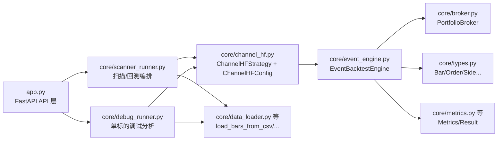
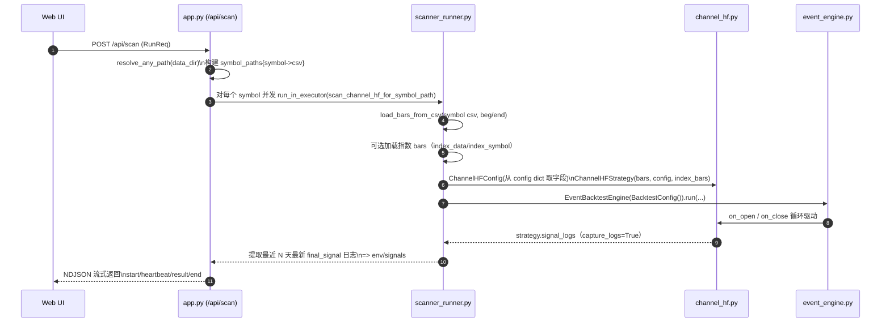
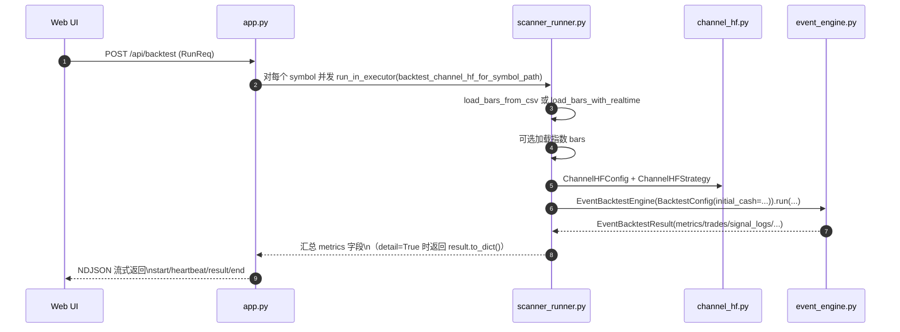
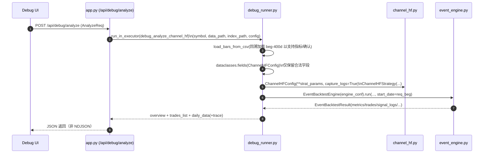

# 项目架构（channel_hf_webui）

本文档描述当前工作目录 [band-strategy](file:///F:\Projects\band-strategy) 的模块划分、运行流程与 Python 文件职责。

## 1. 总览

- **形态**：单体应用（FastAPI Web + 静态前端 + 回测/扫描引擎）。
- **核心能力**
  - 扫描：对一批标的执行策略逻辑，输出最近交易日的信号/环境信息。
  - 回测：事件驱动回测引擎，输出交易明细、绩效指标与可选的 debug 数据。
  - 工具链：数据读取/质量检查/数据同步、选股决策、预设参数管理等。
- **主要入口**
  - Web API： [app.py](file:///d:/BIG_MD/trae/band-strategy-system/channel_hf_webui/app.py)
  - CLI： [core/__main__.py](file:///d:/BIG_MD/trae/band-strategy-system/channel_hf_webui/core/__main__.py) → [core/cli.py](file:///d:/BIG_MD/trae/band-strategy-system/channel_hf_webui/core/cli.py)

## 2. 目录结构

```
channel_hf_webui/
  app.py                # FastAPI 服务端（API + 静态资源挂载 + 预设/配置管理）
  core/                 # 核心回测/策略/数据模块（可被 CLI 与 Web API 复用）
  static_bak/           # 纯静态前端（index.html + app.js）
  data/                 # 示例/本地 CSV 数据
  presets/              # 预设参数（JSON）
  exports/              # 导出结果（例如 trade_features.json 等）
  *.py                  # 若干脚本型工具（对接 API、复现问题、离线检查等）
```

## 3. 运行时数据流（高层）

### 3.1 Web 端（浏览器 → FastAPI → core）

- 浏览器加载静态页面：`/static/index.html` + `/static/app.js`
- 前端通过 `fetch("/api/...")` 调用后端接口
- 后端在 [app.py](file:///d:/BIG_MD/trae/band-strategy-system/channel_hf_webui/app.py) 中：
  - 做参数校验、路径解析、预设读写、任务调度
  - 将重 CPU 的扫描/回测任务分发到 `ProcessPoolExecutor`
  - 调用 `core/*` 完成策略计算与回测

### 3.2 CLI（命令行 → core）

- 入口：`python -m core ...` 或直接调用 [core/cli.py](file:///d:/BIG_MD/trae/band-strategy-system/channel_hf_webui/core/cli.py)
- CLI 直接读取 CSV/目录、构建策略与回测引擎，输出文本/JSON 结果

## 4. 核心模块关系图（概念）

```
app.py
  ├─> core/scanner_runner.py  ──> core/channel_hf.py / core/platform_breakout.py
  ├─> core/debug_runner.py    ──> core/channel_hf.py + debug 解释/复盘逻辑
  ├─> core/data.py            ──> CSV 读取/写入 + 数据同步/质量检查
  ├─> core/selector.py        ──> 选股决策（读取回测结果文件做筛选/解释）
  └─> core/smart_analyze.py   ──> 智能分析（对外部 LLM/模型的封装）

core/event_engine.py
  ├─> PortfolioBroker（core/broker.py）
  ├─> Metrics（core/metrics.py）
  └─> Strategy（如 core/channel_hf.py, core/platform_breakout.py）
```

## 5. 逐文件职责说明（Python）

### 5.1 根目录脚本与服务

- [app.py](file:///d:/BIG_MD/trae/band-strategy-system/channel_hf_webui/app.py)
  - FastAPI 服务主入口：挂载静态资源、定义 `/api/*` 路由。
  - 管理 `config.json` 与 `presets/`：提供预设列表、保存、加载、应用等接口。
  - 组织扫描/回测/调试/数据同步等长任务（包含流式输出接口）。
  - 通过线程池/进程池隔离 IO 与 CPU 计算。

- [analyze_results.py](file:///d:/BIG_MD/trae/band-strategy-system/channel_hf_webui/analyze_results.py)
  - 离线分析脚本：通常用于汇总或检查输出结果（具体以脚本内容为准）。

- [check_current_signals.py](file:///d:/BIG_MD/trae/band-strategy-system/channel_hf_webui/check_current_signals.py)
  - 离线检查当前信号/环境的脚本（便于快速验证某个标的状态）。

- [check_index_status.py](file:///d:/BIG_MD/trae/band-strategy-system/channel_hf_webui/check_index_status.py)
  - 指数状态检查脚本（用于验证指数确认/熊市识别等逻辑）。

- [check_vol_ratio.py](file:///d:/BIG_MD/trae/band-strategy-system/channel_hf_webui/check_vol_ratio.py)
  - 波动率/量能相关检查脚本（用于核对 volatility_ratio 或 vol_ratio 逻辑）。

- [manage_presets.py](file:///d:/BIG_MD/trae/band-strategy-system/channel_hf_webui/manage_presets.py)
  - 预设管理脚本：通常用于批量导入/导出/整理预设。

- [reproduce_issue.py](file:///d:/BIG_MD/trae/band-strategy-system/channel_hf_webui/reproduce_issue.py)
  - 复现历史问题的脚本（给定固定输入，触发并定位 bug）。

- [run_min_backtest.py](file:///d:/BIG_MD/trae/band-strategy-system/channel_hf_webui/run_min_backtest.py)
  - 最小化回测脚本：用于快速跑通引擎/策略主流程。

- [debug_detailed_check.py](file:///d:/BIG_MD/trae/band-strategy-system/channel_hf_webui/debug_detailed_check.py)
  - 细粒度调试检查脚本：通常和 debug_runner 的分析输出配合使用。

- [random_check_20241231.py](file:///d:/BIG_MD/trae/band-strategy-system/channel_hf_webui/random_check_20241231.py)
  - 临时性随机抽样验证脚本（文件名带日期，偏一次性用途）。

- [test_batch_api.py](file:///d:/BIG_MD/trae/band-strategy-system/channel_hf_webui/test_batch_api.py)
  - API 调用/批量接口的测试脚本（不依赖浏览器，走 HTTP）。

- [test_smart_ask.py](file:///d:/BIG_MD/trae/band-strategy-system/channel_hf_webui/test_smart_ask.py)
  - 智能分析能力的测试脚本（验证 smart_analyze 的请求/返回）。

- [calc_20250102.py](file:///d:/BIG_MD/trae/band-strategy-system/channel_hf_webui/calc_20250102.py)
  - 计算/分析的临时脚本（文件名带日期，偏一次性用途）。

### 5.2 core/（核心库）

- [core/__init__.py](file:///d:/BIG_MD/trae/band-strategy-system/channel_hf_webui/core/__init__.py)
  - 包初始化（使 `core` 可被导入）。

- [core/__main__.py](file:///d:/BIG_MD/trae/band-strategy-system/channel_hf_webui/core/__main__.py)
  - CLI 入口：转发到 [core/cli.py](file:///d:/BIG_MD/trae/band-strategy-system/channel_hf_webui/core/cli.py) 的 `main()`。

- [core/cli.py](file:///d:/BIG_MD/trae/band-strategy-system/channel_hf_webui/core/cli.py)
  - 命令行工具：解析参数、读取数据、运行策略与回测、输出结果。
  - 负责把多个子系统（数据、引擎、策略）串成可执行命令。

- [core/types.py](file:///d:/BIG_MD/trae/band-strategy-system/channel_hf_webui/core/types.py)
  - 全局数据结构/类型定义：K线 Bar、订单 Order、成交 Fill、持仓 Position、回测配置等。
  - 多模块共享的“领域模型”。

- [core/data.py](file:///d:/BIG_MD/trae/band-strategy-system/channel_hf_webui/core/data.py)
  - 数据层：CSV 读取/写入、目录加载、可能还包含外部数据源同步与质量检查。
  - Web 端数据同步/质量检查接口会直接调用这里的能力。

- [core/broker.py](file:///d:/BIG_MD/trae/band-strategy-system/channel_hf_webui/core/broker.py)
  - 撮合/账户：资金、持仓、手续费、订单执行、交易生成等。
  - `engine.py` 与 `event_engine.py` 会通过 Broker 抽象统一处理交易逻辑。

- [core/metrics.py](file:///d:/BIG_MD/trae/band-strategy-system/channel_hf_webui/core/metrics.py)
  - 绩效指标：收益率、回撤、夏普/索提诺/卡玛等，以及交易统计。
  - 被引擎层在回测结束后调用，生成统一的指标对象。

- [core/engine.py](file:///d:/BIG_MD/trae/band-strategy-system/channel_hf_webui/core/engine.py)
  - 回测引擎（偏“信号驱动/逐 bar 驱动”风格）：组织 Broker、Strategy、Metrics。
  - 输出 `BacktestResult`（包含 equity curve、fills、orders、metrics 等）。

- [core/event_engine.py](file:///d:/BIG_MD/trae/band-strategy-system/channel_hf_webui/core/event_engine.py)
  - 事件驱动回测引擎：以 `MarketFrame`（某日所有标的）为单位触发 `EventStrategy.on_open/on_close`。
  - 输出 `EventBacktestResult`，并支持更丰富的日志/解释性字段（signal_logs、decision_logs、validation_data 等）。

- [core/strategy.py](file:///d:/BIG_MD/trae/band-strategy-system/channel_hf_webui/core/strategy.py)
  - 多策略集合与基类：例如突破策略、均线交叉策略等（提供 `generate_signal` 等能力）。
  - 包含部分通用的支撑/阻力与出入场规则实现。

- [core/channel_hf.py](file:///d:/BIG_MD/trae/band-strategy-system/channel_hf_webui/core/channel_hf.py)
  - Channel HF（通道高频）策略实现：通道线拟合、归一斜率、显著低点 pivot 选取、量能/波动率过滤、止损与目标价等。
  - 关键算法集中在：
    - `_fit_midline()`：中轨线性拟合
    - `_pick_pivot_low()`：显著低点选择
    - `_get_channel_lines()`：mid/lower/upper/slope_norm 等通道环境输出

- [core/indicators.py](file:///d:/BIG_MD/trae/band-strategy-system/channel_hf_webui/core/indicators.py)
  - 技术指标/形态工具：如斜率计算、平台识别（find_platform）等。
  - 多策略复用的“指标库”。

- [core/platform_breakout.py](file:///d:/BIG_MD/trae/band-strategy-system/channel_hf_webui/core/platform_breakout.py)
  - 平台突破策略：平台识别、突破入场、止损/移动止损、风险控制等，通常配合 `Universe/Fundamentals` 做过滤。

- [core/universe.py](file:///d:/BIG_MD/trae/band-strategy-system/channel_hf_webui/core/universe.py)
  - 股票池/白名单：用于限定可交易标的范围、支持从 CSV 加载等。

- [core/fundamentals.py](file:///d:/BIG_MD/trae/band-strategy-system/channel_hf_webui/core/fundamentals.py)
  - 基本面数据存储与查询：例如 PE、市值等字段（供策略过滤使用）。

- [core/scanner_runner.py](file:///d:/BIG_MD/trae/band-strategy-system/channel_hf_webui/core/scanner_runner.py)
  - Web 扫描/回测的“编排层”：
    - 负责把 Web 请求的 `config` 映射成具体策略配置对象（如 `ChannelHFConfig`、`PlatformBreakoutConfig`）。
    - 调用 `EventBacktestEngine` 执行，并将输出整理成适合 API 返回的结构。
  - 典型被 [app.py](file:///d:/BIG_MD/trae/band-strategy-system/channel_hf_webui/app.py) 的 `/api/scan`、`/api/backtest` 等接口调用。

- [core/debug_runner.py](file:///d:/BIG_MD/trae/band-strategy-system/channel_hf_webui/core/debug_runner.py)
  - 调试分析编排：对单标的给出逐步过滤器通过/失败原因、关键环境值、复盘输出等。
  - 典型被 [app.py](file:///d:/BIG_MD/trae/band-strategy-system/channel_hf_webui/app.py) 的 `/api/debug/analyze` 调用。

- [core/selector.py](file:///d:/BIG_MD/trae/band-strategy-system/channel_hf_webui/core/selector.py)
  - 选股决策模块：读取两类回测结果文件（例如“上轨下系/中轨上系”结果），做筛选与解释输出。
  - 典型被 [app.py](file:///d:/BIG_MD/trae/band-strategy-system/channel_hf_webui/app.py) 的 `/api/selector` 调用。

- [core/smart_analyze.py](file:///d:/BIG_MD/trae/band-strategy-system/channel_hf_webui/core/smart_analyze.py)
  - 智能分析：把“文件 + 问题”封装成可调用的分析能力（当前在 Web API 中暴露为 `/api/smart_analyze`）。

- [core/batch_runner.py](file:///d:/BIG_MD/trae/band-strategy-system/channel_hf_webui/core/batch_runner.py)
  - 批处理辅助：路径解析、批量运行工具函数等（多处 runner/脚本复用）。

- [core/analyzer.py](file:///d:/BIG_MD/trae/band-strategy-system/channel_hf_webui/core/analyzer.py)
  - 分析器：更偏“信号计算/环境计算/复盘输出”的工具层（常用于生成 SIG_CONFIG、解释性统计等）。

- [core/notification.py](file:///d:/BIG_MD/trae/band-strategy-system/channel_hf_webui/core/notification.py)
  - 通知能力（如将结果推送到外部渠道）；目前更多作为可选扩展点。

## 6. 前后端耦合点（参数与命名）

- 前端静态页面在 [static_bak/index.html](file:///d:/BIG_MD/trae/band-strategy-system/channel_hf_webui/static_bak/index.html) 定义表单与控件。
- 前端逻辑在 [static_bak/app.js](file:///d:/BIG_MD/trae/band-strategy-system/channel_hf_webui/static_bak/app.js)：
  - `getStrategyConfigFromUI()` 将 UI 字段拼成后端需要的 JSON（映射到 [app.py](file:///d:/BIG_MD/trae/band-strategy-system/channel_hf_webui/app.py) 的 `RunReq`）。
  - 扫描/回测等流程通过 `/api/scan`、`/api/backtest` 等接口触发。

## 7. 常见扩展方式（落点建议）

- 新增策略：
  - 在 `core/` 新建策略实现（建议继承 `EventStrategy`），并在 `core/cli.py` 与 `core/scanner_runner.py` 增加编排入口。
- 新增指标/形态工具：
  - 放到 [core/indicators.py](file:///d:/BIG_MD/trae/band-strategy-system/channel_hf_webui/core/indicators.py) 或拆分为更细的模块（保持纯函数、可测试）。
- 新增 Web API：
  - 在 [app.py](file:///d:/BIG_MD/trae/band-strategy-system/channel_hf_webui/app.py) 增加路由，避免把核心业务逻辑写进路由函数，尽量调用 `core/*`。

## 8. 数据流与模块依赖图

本节以一次完整的“扫描（/api/scan）”与“回测（/api/backtest、/api/backtest_detail）”为例，说明数据在 `app.py -> scanner_runner.py -> channel_hf.py -> event_engine.py` 以及调试链路 `app.py -> debug_runner.py -> channel_hf.py -> event_engine.py` 之间如何流动。

### 8.1 模块依赖（静态）



### 8.2 “扫描”请求数据流（/api/scan）

入口：[api_scan](file:///d:/BIG_MD/trae/band-strategy-system/channel_hf_webui/app.py#L610-L803)  
编排函数：[scan_channel_hf_for_symbol_path](file:///d:/BIG_MD/trae/band-strategy-system/channel_hf_webui/core/scanner_runner.py#L363-L464)



**关键数据形态**

- 请求体：`RunReq`（见 [app.py:L67-L121](file:///d:/BIG_MD/trae/band-strategy-system/channel_hf_webui/app.py#L67-L121)）。
- API 内部临时映射：`symbol_paths: dict[str, Path]`，把目录下 `*.csv` 映射为标的列表。
- 并发与流式输出：`/api/scan` 用 `StreamingResponse(application/x-ndjson)`，逐行输出：
  - `{"type":"start","job_id":...,"total":...}`
  - `{"type":"heartbeat","progress":"done/total"}`
  - `{"type":"result","data":{...}}`
  - `{"type":"end"}`
- 单标的扫描结果（Runner 返回给 API）：`{"symbol", "last_date", "env", "signals"}`，其中 `env/signals` 来自 `ChannelHFStrategy.signal_logs` 的最近一条 `final_signal in (1,-1)` 的日志。

### 8.3 “回测”请求数据流（/api/backtest、/api/backtest_detail）

入口：
- 批量回测：[api_backtest](file:///d:/BIG_MD/trae/band-strategy-system/channel_hf_webui/app.py#L828-L937)
- 单标的明细回测：[api_backtest_detail](file:///d:/BIG_MD/trae/band-strategy-system/channel_hf_webui/app.py#L1062-L1117)

编排函数：[backtest_channel_hf_for_symbol_path](file:///d:/BIG_MD/trae/band-strategy-system/channel_hf_webui/core/scanner_runner.py#L187-L361)



**回测结果在层间的“粒度差异”**

- `/api/backtest`（批量）默认只取 `metrics` 的关键字段组装成轻量 dict 返回（例如 `total_return/sharpe/trades/anomalies/...`）。
- `/api/backtest_detail` 会强制 `detail=True`，Runner 返回 `result.to_dict()`，包含 `signal_logs/decision_logs/validation_data/trades` 等更全的结构。

### 8.4 “调试分析”请求数据流（/api/debug/analyze）

入口：[api_debug_analyze](file:///d:/BIG_MD/trae/band-strategy-system/channel_hf_webui/app.py#L1640-L1687)  
编排函数：[debug_analyze_channel_hf](file:///d:/BIG_MD/trae/band-strategy-system/channel_hf_webui/core/debug_runner.py#L428-L639)



**调试链路与扫描/回测的关键差异**

- Debug 强制 `capture_logs=True`，并把 `ChannelHFConfig` 的有效字段从 `config dict` 里过滤出来，避免前端传入的非策略字段污染策略构造。
- Debug 返回的 `daily_data` 会把每个交易日 OHLCV 与 `signal_logs` 里的通道/过滤器 trace 合并，便于前端画图与逐步解释。

### 8.5 引擎内部的数据流（策略如何“被驱动”）

引擎实现：[EventBacktestEngine.run](file:///d:/BIG_MD/trae/band-strategy-system/channel_hf_webui/core/event_engine.py#L385-L558)

- 输入：`bars: list[Bar]`（可能包含多标的，按日期分桶），`strategy: EventStrategy`，可选 `benchmark_bars`，可选 `start_date`。
- 主循环：对每个交易日 `T`：
  - 执行 `pending_orders[T]`（上一交易日收盘后生成，T 日开盘执行）
  - 调用 `strategy.on_open(i, frame, broker)`
  - 用收盘价 `mark_to_market` 更新权益
  - 调用 `strategy.on_close(i, frame, broker)` 生成订单，调度到 `T+1` 开盘执行
- 输出：`EventBacktestResult(metrics/trades/signal_logs/decision_logs/validation_data/data_anomalies)`

### 8.6 批量测试 / 拒绝分析 / 参数说明 UI（入口、接口、模块）

本节以“文档式问答”的方式，补齐三块功能的前后端入口与模块落点，便于排查问题与二次开发。

#### 8.6.1 批量测试功能（参数组合批量回测）

**前端入口**

- URL：本项目为单页应用，入口统一为 `/`（见 [index()](file:///d:/BIG_MD/trae/band-strategy-system/channel_hf_webui/app.py#L605-L607) 返回 [index.html](file:///d:/BIG_MD/trae/band-strategy-system/channel_hf_webui/static_bak/index.html)），无独立 `/batch_test` 页面路由。
- 页面位置：位于“回测”视图（`view-backtest`）中的“批量参数测试”卡片。
- 关键按钮 ID：
  - `pt-run-btn`：开始/停止批量测试（见 [index.html](file:///d:/BIG_MD/trae/band-strategy-system/channel_hf_webui/static_bak/index.html#L603-L633)）。
  - `pt-export-btn`：导出结果（CSV）（同上）。
- 前端主函数：`runParamBatchTest()`（见 [runParamBatchTest](file:///d:/BIG_MD/trae/band-strategy-system/channel_hf_webui/static_bak/app.js#L1747)）。

**后端接口**

- `POST /api/param_batch_test`：批量参数测试（NDJSON 流式输出，逐行 JSON）（见 [api_param_batch_test](file:///d:/BIG_MD/trae/band-strategy-system/channel_hf_webui/app.py#L939-L1056)）。
- 响应类型：`application/x-ndjson`，典型消息形态：
  - `{"type":"start","total":...,"combos":...,"symbols":...}`
  - `{"type":"combo_start","combo_idx":...,"combo_label":...}`
  - `{"type":"result","status":"success","data":{...},"combo_label":...,"combo":{...}}`
  - `{"type":"heartbeat","progress":"done/total"}`
  - `{"type":"end","progress":"done/total"}`

**核心模块（Python）**

- 任务编排（组合循环 + 并发 + 流式输出）：[api_param_batch_test](file:///d:/BIG_MD/trae/band-strategy-system/channel_hf_webui/app.py#L939-L1056)（在 API 层直接实现）。
- 单标的回测执行：`backtest_channel_hf_for_symbol_path(symbol, data_path, index_path, config)`（见 [scanner_runner.py](file:///d:/BIG_MD/trae/band-strategy-system/channel_hf_webui/core/scanner_runner.py#L187-L361)）。
  - 内部会构造 `ChannelHFConfig`、`ChannelHFStrategy` 并由 `EventBacktestEngine.run` 驱动。

#### 8.6.2 拒绝分析前端（查看详情弹窗）

**触发方式**

- 触发入口在“回测结果表格”的每行渲染逻辑：当该标的被拒绝（`error` 或 `reasons` 非空）时，渲染“查看详情”按钮：
  - `onclick="showRejectionDetails('${symbol}')"`（见 [renderBacktestRowToTbody](file:///d:/BIG_MD/trae/band-strategy-system/channel_hf_webui/static_bak/app.js#L2622-L2671)）。
- 弹窗主函数：`showRejectionDetails(symbol)`（见 [showRejectionDetails](file:///d:/BIG_MD/trae/band-strategy-system/channel_hf_webui/static_bak/app.js#L1544)）。

**后端 API（现状与注意点）**

- 后端真实存在的“单标的回测明细”接口为：`POST /api/backtest_detail`（见 [api_backtest_detail](file:///d:/BIG_MD/trae/band-strategy-system/channel_hf_webui/app.py#L1062-L1117)）。
- 前端当前用于拉取详情的函数是 `fetchBacktestDetailForSymbol(symbol)`，它调用的是：`GET /api/backtest/detail?...`（见 [fetchBacktestDetailForSymbol](file:///d:/BIG_MD/trae/band-strategy-system/channel_hf_webui/static_bak/app.js#L2674-L2698)）。
- 因此前后端存在一个“路径/方法不一致”的问题：前端 `GET /api/backtest/detail` 与后端 `POST /api/backtest_detail` 并不匹配，需要二次对齐后拒绝详情弹窗才能稳定工作。

**返回数据格式（后端当前实际结构）**

- `POST /api/backtest_detail` 最终返回的是 `EventBacktestResult.to_dict()`（见 [EventBacktestResult.to_dict](file:///d:/BIG_MD/trae/band-strategy-system/channel_hf_webui/core/event_engine.py#L222-L280)）并额外补充 `symbol/beg/end`。
- “拒绝原因的可解释性”主要来自 `signal_logs[*].trace[*]`，其结构由策略侧组装（见 [add_trace](file:///d:/BIG_MD/trae/band-strategy-system/channel_hf_webui/core/channel_hf.py#L325-L335)），每个 step 包含：
  - `step/check/threshold/actual/passed/reason`

JSON 示例（节选）：

```json
{
  "metrics": { "total_return": 0.1234, "cagr": 0.0567, "max_drawdown": 0.0876, "trade_count": 12, "win_rate": 0.5833 },
  "trades": [ { "symbol": "000001.SZ", "entry_dt": "2024-01-10", "exit_dt": "2024-02-02", "entry_price": 10.123, "exit_price": 10.456 } ],
  "signal_logs": [
    {
      "date": "2024-01-10",
      "symbol": "000001.SZ",
      "final_signal": 0,
      "trace": [
        { "step": "ChanHeight", "check": "Height >= Min", "threshold": ">=0.050", "actual": "0.032", "passed": false, "reason": "Channel too narrow" }
      ]
    }
  ]
}
```

#### 8.6.3 参数说明 UI（配置页/弹窗）

**实现方式**

- 参数说明为前端硬编码：`PARAM_DEFINITIONS` 常量（见 [PARAM_DEFINITIONS](file:///d:/BIG_MD/trae/band-strategy-system/channel_hf_webui/static_bak/app.js#L6-L80)）。
- 展示形态有两种：
  - 配置页内联说明：点击/聚焦配置项时，调用 `_renderParamHelpInline(key)` 写入 `#config-help-content`（见 [_renderParamHelpInline](file:///d:/BIG_MD/trae/band-strategy-system/channel_hf_webui/static_bak/app.js#L1488-L1516) 与 [index.html:config-help-content](file:///d:/BIG_MD/trae/band-strategy-system/channel_hf_webui/static_bak/index.html#L530)）。
  - 全量说明弹窗：`showParamHelpModal()` 遍历 `PARAM_DEFINITIONS` 动态生成弹窗内容（见 [showParamHelpModal](file:///d:/BIG_MD/trae/band-strategy-system/channel_hf_webui/static_bak/app.js#L1968-L2053)）。

**数据源**

- 不从后端加载；数据源就是前端文件 [static_bak/app.js](file:///d:/BIG_MD/trae/band-strategy-system/channel_hf_webui/static_bak/app.js) 内的 `PARAM_DEFINITIONS`。

## 9. 已知问题与待办清单

### 9.1 已知问题（尚未解决）

- 拒绝分析链路尚未闭环：前端详情拉取使用 `GET /api/backtest/detail?...`，但后端提供的是 `POST /api/backtest_detail`，并且返回结构中也未生成结构化 `rejections[]`，导致“查看详情”弹窗无法稳定展示（见 [fetchBacktestDetailForSymbol](file:///d:/BIG_MD/trae/band-strategy-system/channel_hf_webui/static_bak/app.js#L2674-L2698) 与 [api_backtest_detail](file:///d:/BIG_MD/trae/band-strategy-system/channel_hf_webui/app.py#L1062-L1117)）。
- 核心回测时序与触发条件存在一致性风险：引擎设计为“`T` 日收盘生成信号、`T+1` 开盘执行”（见 [EventBacktestEngine.run](file:///d:/BIG_MD/trae/band-strategy-system/channel_hf_webui/core/event_engine.py#L385-L523)），但策略在 `on_close` 中会用当日 `bar.high/bar.low` 触发卖出/止损分支（如 `bar.high >= target_px`、`bar.low <= stop_px*(1-panic_eps)`，见 [ChannelHFStrategy.on_close 退出逻辑](file:///d:/BIG_MD/trae/band-strategy-system/channel_hf_webui/core/channel_hf.py#L608-L669)）。这会造成“用日内极值触发，但在次日开盘成交”的口径混用，需要明确策略假设或改为更一致的撮合/触发方式。
- 扫描模式对 `ChannelHFConfig` 仅赋值了字段子集，部分策略参数即使在前端/预设中存在也不会生效（见 [scan_channel_hf_for_symbol_path 构造 ChannelHFConfig](file:///d:/BIG_MD/trae/band-strategy-system/channel_hf_webui/core/scanner_runner.py#L363-L422)）。例如 Pivot 确认相关的 `pivot_confirm_days/pivot_no_new_low_tol/pivot_rebound_amp/...` 在 scan/backtest 编排中未统一透传。
- 配置项存在历史遗留字段：`RunReq` 与预设中包含 `slope_vol_max`，但当前主链路不使用（仅在备份文件里出现）（见 [RunReq:slope_vol_max](file:///d:/BIG_MD/trae/band-strategy-system/channel_hf_webui/app.py#L96-L120) 与 [scanner_runner.py.bak](file:///d:/BIG_MD/trae/band-strategy-system/channel_hf_webui/core/scanner_runner.py.bak)）。
- 参数默认值口径不一致，容易造成误解：`RunReq.scan_recent_days` 默认 `1`（见 [RunReq](file:///d:/BIG_MD/trae/band-strategy-system/channel_hf_webui/app.py#L67-L121)），而 `ChannelHFConfig.scan_recent_days` 默认 `20`（见 [ChannelHFConfig](file:///d:/BIG_MD/trae/band-strategy-system/channel_hf_webui/core/channel_hf.py#L38-L99)）；scan 编排里又会把 `config.get("scan_recent_days", 1)` 作为阈值（见 [scan_channel_hf_for_symbol_path:recent_n](file:///d:/BIG_MD/trae/band-strategy-system/channel_hf_webui/core/scanner_runner.py#L427-L437)）。三处默认值并非同一口径。

### 9.2 待办清单（计划但尚未实现）

- 完成 TASK-001-URGENT：为核心算法（显著低点/pivot、斜率、通道线、量能过滤）编写独立、可重复执行的数学验证测试脚本，并对关键边界条件（样本长度、极端价格、缺失量能等）做回归测试。
- 统一 ChannelHFConfig 的“参数透传层”：把 scan/backtest/debug 三条链路的 `ChannelHFConfig(**kwargs)` 构造逻辑合并为单一映射函数，确保所有字段一致可控（避免 scan/backtest/debug 行为差异来自“漏传字段”）。
- 为“拒绝分析”补齐后端结构化输出：基于 `signal_logs[*].trace` 生成 `rejections[]`（日期、过滤器、条件、实际值、阈值、原因），并在 `/api/backtest_detail` 或 `/api/debug/analyze` 的返回中携带，确保前端弹窗可用。
- 清理/迁移遗留参数与备份文件：删除或迁移 `*.bak`、移除未使用字段（如 `slope_vol_max`）或补齐其真实用途，避免预设与 UI 误导。
- 参数批量测试能力“闭环”：当前已有 `/api/param_batch_test` 与前端网格生成器，但建议补齐结果聚合（按组合/按标的 topN、失败原因统计、导出）与运行可取消（对齐 scan 的 job_id/cancel 体验）。

## 附录 A：channel_hf.py 核心函数接口说明书

对应源码区间：[core/channel_hf.py:L172-L275](file:///d:/BIG_MD/trae/band-strategy-system/channel_hf_webui/core/channel_hf.py#L172-L275)

### A.1 `_fit_midline()`

**精确签名**

```python
def _fit_midline(self, closes: np.ndarray) -> tuple[float, float]:
```

**参数**

- `self`: `ChannelHFStrategy`
- `closes`: `np.ndarray`（收盘价序列，长度 n）

**返回值**

- `tuple[float, float]`，按顺序为：
  - `m`: 斜率（拟合直线 `y = m*x + c`）
  - `c`: 截距

**数学逻辑**

- 这是对 `closes` 的一元线性回归（最小二乘）闭式解实现。
- 令 `x = 0..n-1`，通过中心化 `x_centered = x - mean(x)` 提升数值稳定性。
- 斜率与截距等价于：
  - `m = Σ (x - x̄)(y - ȳ) / Σ (x - x̄)²`
  - `c = ȳ - m*x̄`
- 边界处理：
  - `n < 2`：返回 `(0.0, closes[-1])`（空输入时返回 `(0.0, 0.0)`）
  - 分母为 0：斜率置 0

### A.2 `_pick_pivot_low()`

**精确签名**

```python
def _pick_pivot_low(self, lows: np.ndarray, highs: np.ndarray) -> int | None:
```

**参数**

- `self`: `ChannelHFStrategy`
- `lows`: `np.ndarray`（窗口内低价序列）
- `highs`: `np.ndarray`（窗口内高价序列）

**返回值**

- `int | None`
  - `int`：显著低点在窗口内的索引 `j`（0-based）
  - `None`：找不到满足“显著低点”条件的点

**判定逻辑（窗口、跌幅与反弹确认）**

该函数在窗口内扫描候选 `j`，候选必须同时满足：

- 样本长度：令 `k = max(1, int(self.config.pivot_k))`，若 `n < 2*k + 3` 则直接返回 `None`。
- 局部极小（严格）：`lows[j]` 需严格小于左侧 `k` 天最低与右侧 `k` 天最低：
  - `lows[j] < min(lows[j-k : j])`
  - `lows[j] < min(lows[j+1 : j+1+k])`
- 价格有效：`lows[j] > 0` 且 `max(highs[:j+1]) > 0`。
- 跌幅阈值（显著性）：定义此前最高点到该低点的跌幅比：
  - `drop = (prev_peak / lows[j]) - 1`
  - 需满足 `drop >= pivot_drop_min`，其中 `pivot_drop_min = max(0.0, float(self.config.pivot_drop_min))`。
- 反弹确认：令 `rebound_days = max(1, int(self.config.pivot_rebound_days))`，取 `after = lows[j+1 : j+1+rebound_days]`：
  - 若 `min(after) <= lows[j]` 则淘汰（后续又创新低，低点不稳）。
- 候选选择：在所有候选中，优先选“低点价格更低”的；若低点价格相同，选“更靠近窗口末端（更近期）”的（排序 key 为 `(low, -j)`）。

### A.3 `_get_channel_lines()`

**精确签名**

```python
def _get_channel_lines(
    self,
    symbol: str,
    i: int
) -> tuple[float, float, float, float, float, int | None, int | None, float, bool] | None:
```

**参数**

- `self`: `ChannelHFStrategy`
- `symbol`: `str`（标的代码）
- `i`: `int`（当前 bar 的索引）

**返回值**

- `None`：数据不足或缺失无法计算（例如 `i+1 < period`，或该 symbol 的数组不存在）。
- 否则返回 9 元组，按返回顺序为：
  1. `mid: float`：中轨（窗口最后一天的拟合值）
  2. `lower: float`：下轨
  3. `upper: float`：上轨
  4. `slope_norm: float`：归一斜率
  5. `vol_ratio: float`：当前成交量 / 窗口平均成交量
  6. `pivot_j: int | None`：窗口内 pivot 索引（实现里通常为 int）
  7. `pivot_abs_i: int | None`：pivot 对应的全局绝对索引
  8. `pivot_low: float`：pivot 低点价格
  9. `pivot_is_sig: bool`：是否命中“显著低点规则”（`_pick_pivot_low()` 非空）

**数学逻辑**

- 窗口：`period = max(10, int(self.config.channel_period))`，取 `[i-period+1, ..., i]` 的 `closes/highs/lows/vols`。
- 中轨拟合：调用 `_fit_midline(closes)` 得 `m, c`，令 `x_last = period - 1`，`mid = m*x_last + c`。
- 归一斜率：`slope_norm = (m / mid) if mid > 0 else 0.0`，把“价格斜率”归一到当前价格水平以便可比。
- 选 pivot：
  - 优先 `pivot_pick = _pick_pivot_low(lows, highs)`；
  - 若为 `None`，退化为 `pivot_j = argmin(lows)`。
- 下轨锚定与上下轨对称：
  - `pivot_mid = m*pivot_j + c`
  - `offset = pivot_low - pivot_mid`
  - `lower = mid + offset`
  - `upper = mid - offset`
- 量能比：
  - `avg_vol = mean(vols)`，`cur_vol = vols[-1]`
  - `vol_ratio = cur_vol / avg_vol`（若 `avg_vol == 0` 则置 1）

## 附录 B：ChannelHFConfig 策略配置参数全集

对应源码区间：[core/channel_hf.py:L38-L99](file:///d:/BIG_MD/trae/band-strategy-system/channel_hf_webui/core/channel_hf.py#L38-L99)

- 默认值：来自 `ChannelHFConfig` dataclass 的字段默认值。
- 建议范围：偏“经验默认”，需要结合你的标的/周期回测校准。
- 安全取水：标记与“更重视风控/确定性、减少过度激进”更强相关的参数。

### B.1 通道与交易触发

| 参数名 | 中文名 | 默认值 | 建议范围/枚举 | 单位 | 作用 | 安全取水 |
| --- | --- | --- | --- | --- | --- | --- |
| `channel_period` | 通道窗口长度 | `20` | `10` ~ `120` | 天 | 通道拟合窗口长度（最小会被钳制到 10） | 是 |
| `buy_touch_eps` | 触下轨容忍 | `0.005` | `0.000` ~ `0.020` | 比例 | 低点触发阈值：`low <= lower*(1+eps)` 才允许入场 | 否 |
| `sell_trigger_eps` | 卖出触发偏移 | `0.005` | `0.000` ~ `0.020` | 比例 | 卖出目标价的偏移（取决于 `sell_target_mode`） | 否 |
| `sell_target_mode` | 卖出目标模式 | `"mid_up"` | `mid_up` / `upper_down` / `mid_down` | - | 目标价：`mid_up` 用 `mid*(1+eps)`；`upper_down` 用 `upper*(1-eps)`；其它值回退到 `mid*(1-eps)` | 否 |
| `channel_break_eps` | 破位阈值 | `0.02` | `0.000` ~ `0.080` | 比例 | 离场破位线：`close < lower*(1-eps)` 触发离场 | 是 |

### B.2 止损与持仓节奏

| 参数名 | 中文名 | 默认值 | 建议范围/枚举 | 单位 | 作用 | 安全取水 |
| --- | --- | --- | --- | --- | --- | --- |
| `stop_loss_mul` | 初始止损乘数 | `0.97` | `0.80` ~ `0.999` | 倍数 | 入场后初始止损：`initial_stop = entry_px * stop_loss_mul` | 是 |
| `stop_loss_on_close` | 收盘止损 | `True` | `True` / `False` | - | `True` 用 `close <= stop`；`False` 用 `low <= stop` | 是 |
| `stop_loss_panic_eps` | 恐慌止损额外缓冲 | `0.02` | `0.000` ~ `0.100` | 比例 | 若 `low <= stop*(1-panic_eps)` 触发“恐慌止损” | 是 |
| `max_holding_days` | 最大持仓天数 | `20` | `1` ~ `250` | 天 | 超过后强制时间止盈/止损离场（`TimeExit`） | 是 |
| `cooling_period` | 冷却期 | `5` | `0` ~ `30` | 天 | 平仓后冷却 N 天不再开仓 | 是 |
| `scan_recent_days` | 扫描近 N 天 | `20` | `1` ~ `60` | 天 | 扫描/回测编排层常用于“只看最近 N 天信号” | 否 |

### B.3 通道质量与量价过滤

| 参数名 | 中文名 | 默认值 | 建议范围/枚举 | 单位 | 作用 | 安全取水 |
| --- | --- | --- | --- | --- | --- | --- |
| `slope_abs_max` | 最大绝对归一斜率 | `0.01` | `0.000` ~ `0.050` | - | 限制通道过陡：`abs(slope_norm) <= slope_abs_max` | 是 |
| `vol_shrink_threshold` | 量能阈值 | `0.9` | `0.3` ~ `1.5` | 倍数 | 若未设置 `vol_shrink_min/max`：当阈值 `<1` 用 `vol_ratio <= thr`；当阈值 `>=1` 用 `vol_ratio >= thr` | 是 |
| `vol_shrink_min` | 量能下限（可选） | `None` | `0.0` ~ `10.0` 或 `None` | 倍数 | 若设置了任一 `vol_shrink_min/max`，则使用区间过滤 `min <= vol_ratio <= max` | 是 |
| `vol_shrink_max` | 量能上限（可选） | `None` | `0.0` ~ `10.0` 或 `None` | 倍数 | 同上 | 是 |
| `volatility_ratio_max` | 波动率比上限 | `1.0` | `0.5` ~ `1.2` | 倍数 | 仅当 `<1.0` 时启用：短窗/长窗波动率比需 `<= max`（过热过滤） | 是 |
| `min_channel_height` | 最小通道高度 | `0.05` | `0.010` ~ `0.300` | 比例 | 过滤过窄通道：`(upper-lower)/mid >= min_channel_height` | 是 |
| `min_mid_room` | 到中轨最小空间 | `0.015` | `0.000` ~ `0.100` | 比例 | 过滤“离中轨太近没空间”的入场：`(mid-lower)/mid >= min_mid_room` | 是 |
| `min_mid_profit_pct` | 最小潜在收益率 | `0.0` | `0.0` ~ `0.10` | 比例 | 若 >0：要求 `(target_px/entry_px)-1 >= min_mid_profit_pct` | 是 |
| `min_rr_to_mid` | 最小风险收益比 | `0.0` | `0.0` ~ `5.0` | 倍数 | 若 >0：要求 `RR = (target-entry)/(entry-stop) >= min_rr_to_mid` | 是 |
| `min_slope_norm` | 最小归一斜率 | `-1.0` | `-1.0` ~ `0.05` | - | 若 `>-1`：要求 `slope_norm >= min_slope_norm`（限制下行趋势） | 是 |

### B.4 Pivot（显著低点）确认

| 参数名 | 中文名 | 默认值 | 建议范围/枚举 | 单位 | 作用 | 安全取水 |
| --- | --- | --- | --- | --- | --- | --- |
| `pivot_k` | 局部极小窗口半径 | `2` | `1` ~ `10` | 天 | 显著低点的局部极小判定窗口（样本需满足 `n >= 2*k+3`） | 是 |
| `pivot_drop_min` | 最小跌幅阈值 | `0.03` | `0.00` ~ `0.50` | 比例 | 从此前最高点到候选低点的跌幅需 `>= pivot_drop_min` | 是 |
| `pivot_rebound_days` | 反弹天数确认 | `2` | `1` ~ `10` | 天 | 低点后 N 天不再创新低，否则淘汰该低点 | 是 |
| `pivot_confirm_days` | 低点确认等待天数 | `3` | `0` ~ `20` | 天 | 若 >0：要求低点出现后至少过去 N 天才允许入场 | 是 |
| `pivot_no_new_low_tol` | 不创新低容忍 | `0.01` | `0.0` ~ `0.10` | 比例 | 确认窗口内最低价需满足 `min_low >= pivot_low*(1-tol)` | 是 |
| `pivot_rebound_amp` | 最小反弹幅度 | `0.02` | `0.0` ~ `0.30` | 比例 | 确认窗口内 `max_high/pivot_low - 1 >= pivot_rebound_amp` | 是 |
| `pivot_confirm_requires_sig` | 仅接受显著低点 | `True` | `True` / `False` | - | `True` 时要求 `_pick_pivot_low()` 命中显著低点规则 | 是 |

### B.5 指数过滤（择时）

| 参数名 | 中文名 | 默认值 | 建议范围/枚举 | 单位 | 作用 | 安全取水 |
| --- | --- | --- | --- | --- | --- | --- |
| `require_index_condition` | 启用指数状态过滤 | `True` | `True` / `False` | - | 指数“熊市形态”时禁止开仓 | 是 |
| `index_symbol` | 指数代码 | `"000300.SH"` | 代码字符串 | - | 用于加载指数 K 线与过滤条件计算 | 否 |
| `index_ma_5` | 指数 MA5 | `5` | 正整数 | 天 | 与 `index_ma_10/20/30` 一起用于“熊市形态”判定 | 否 |
| `index_ma_10` | 指数 MA10 | `10` | 正整数 | 天 | 同上 | 否 |
| `index_ma_20` | 指数 MA20 | `20` | 正整数 | 天 | 同上 | 否 |
| `index_ma_30` | 指数 MA30 | `30` | 正整数 | 天 | 同上（满足 `MA30 > MA20 > MA10 > MA5` 视为熊市） | 是 |
| `index_bear_exit` | 熊市强制离场 | `True` | `True` / `False` | - | 持仓期间若指数进入熊市形态，触发离场 `IndexBear` | 是 |
| `index_trend_ma_period` | 指数趋势 MA | `0` | `0` 或 `20`~`250` | 天 | 若 >0：额外要求指数 `close >= MA(period)` 才允许开仓 | 是 |

### B.6 仓位、撮合与调试

| 参数名 | 中文名 | 默认值 | 建议范围/枚举 | 单位 | 作用 | 安全取水 |
| --- | --- | --- | --- | --- | --- | --- |
| `max_positions` | 最大持仓标的数 | `5` | `1` ~ `50` | 只 | 同时持仓数量上限 | 是 |
| `max_position_pct` | 单标的最大资金占比 | `1.0` | `0.05` ~ `0.30` | 比例 | 下单资金：`equity * max_position_pct`（默认 1.0 为“允许满仓单票”） | 是 |
| `entry_fill_eps` | 买入滑点 | `0.002` | `0.0` ~ `0.02` | 比例 | 估算入场成交价：`entry_px = close*(1+eps)` | 是 |
| `exit_fill_eps` | 卖出滑点 | `0.002` | `0.0` ~ `0.02` | 比例 | 估算离场成交价：`exit_px = close*(1-eps)`（目前用于计算但卖单为市价） | 是 |
| `fill_at_close` | 收盘撮合 | `True` | `True` / `False` | - | 买单 `limit_price` 是否按收盘价+滑点撮合（影响回测撮合方式） | 否 |
| `capture_logs` | 捕获决策日志 | `False` | `True` / `False` | - | 开启后记录逐步过滤 trace（用于 debug/analyze） | 否 |
| `trend_ma_period` | 个股趋势 MA | `0` | `0` 或 `20`~`250` | 天 | 若 >0：额外要求个股 `close >= MA(period)` 才允许开仓 | 是 |
| `require_rebound` | 要求从下轨反弹 | `False` | `True` / `False` | - | 若开启：要求 `close >= lower` 才允许开仓 | 是 |
| `require_green` | 要求阳线 | `False` | `True` / `False` | - | 若开启：要求 `close > open` 才允许开仓 | 否 |

10. 三层架构规范与文件映射
为根治模块混乱、实现高效协作，特确立以下三层架构规范。所有开发、修复与重构任务，必须明确其所属层级及目标文件。

10.1 架构总览
系统严格分为三层，下层为上层提供能力，禁止跨层调用（如表现层直接调用核心层）。

text
表现层 (Presentation) -> 编排层 (Orchestration) -> 核心层 (Core)
10.2 各层定义与文件清单
层级	职责	文件清单（channel_hf_webui/ 下）
核心层 (Core Layer)	纯业务逻辑、数学模型、领域实体与基础计算。不感知调用来源（Web/CLI/调试）。	core/channel_hf.py
core/event_engine.py
core/strategy.py, core/platform_breakout.py
core/indicators.py
core/broker.py, core/metrics.py
core/data.py, core/types.py
core/universe.py, core/fundamentals.py
编排层 (Orchestration Layer)	组装核心层模块，处理用例特定的流程与配置转换。是连接“用户意图”与“核心逻辑”的桥梁。	core/scanner_runner.py （回测/扫描用例）
core/debug_runner.py （调试用例）
core/selector.py, core/smart_analyze.py
表现层 (Presentation Layer)	与用户直接交互，接收输入、呈现输出，不含业务逻辑。	app.py （HTTP API， 路由， 静态服务）
static_bak/ 目录下所有文件 （前端UI）
10.3 协作纪律
指令明确：所有任务指令必须明确 “修改/新增哪一层的哪个（哪些）文件”。

核心共享：对核心层的修改，必须确保其普适性，不得为特定用例（如调试）引入特化代码。

编排隔离：对编排层某用例文件的修改，如涉及公共逻辑，应优先考虑提取至共享函数或新模块（如计划中的 core/runner.py），避免重复。

基准唯一：策略参数的最终验证与绩效评估，必须且仅以回测用例（scanner_runner.py 编排）的输出为准。

10.4 示例：任务A“修复拒绝分析桥梁”的指令分解
表现层 (app.py)：新增 GET /api/backtest/detail 路由函数 (api_backtest_detail_get)，作为前端调用桥梁。

核心层 (core/event_engine.py)：在 EventBacktestResult.to_dict() 方法中，新增从 signal_logs 的 trace 生成 rejections 列表的逻辑，并移除对 final_signal == 0 的错误依赖。

验收标准：回测结果页点击“查看详情”，弹窗能显示结构化的拒绝原因列表。

10.5 架构演进记录
2025-01-09：正式确立本规范。任务A（拒绝分析桥梁）成为首个遵循此规范完成修复的任务，验证了流程有效性。

  ## 11. 批量测试增强系统

### 11.1 设计目标
- **高并发支持**: 安全处理多任务并行执行
- **实时状态追踪**: 提供精确的任务进度与状态反馈
- **聚合分析**: 实时计算批次任务的统计指标
- **可控性**: 支持任务取消与资源清理

### 11.2 BatchTaskManager 类设计
#### 核心职责
- 任务队列管理（创建、查询、取消）
- 进度跟踪与状态维护
- 结果收集与聚合计算
- 线程安全保证

#### 关键数据结构
```python
class BatchTaskManager:
    def __init__(self):
        self._tasks = {}      # 任务元数据 {task_id: {...}}
        self._results = {}    # 任务结果 {task_id: [...])
        self._aggregation_cache = {}  # 聚合结果缓存
        self._lock = threading.RLock()  # 可重入锁保证线程安全  11.3 任务状态机 text 复制   下载    created → running → completed
                ↘ cancelled  状态说明 •  created: 任务已创建，等待执行  •  running: 任务执行中，可查询进度  •  completed: 任务正常完成，可获取完整结果  •  cancelled: 任务被取消，保留部分结果   11.4 聚合统计计算规范 计算时机 •  实时更新：每完成一个子任务更新一次  •  最终汇总：任务完成时生成最终统计   统计字段     字段 说明 计算公式   win_rate 胜率 盈利交易数 / 总交易数  avg_return 平均收益率 总收益 / 交易数  rejection_rate 拒绝率 拒绝分析数 / 总分析数  return_distribution 收益分布 所有交易收益的列表    计算规则 •  只对包含必需字段的结果进行统计  •  空结果或异常结果不影响统计准确性  •  缓存机制避免重复计算   12. 任务管理接口规范 12.1 RESTful 接口设计 批量任务取消接口 http 复制   下载    POST /batch_test/cancel
Content-Type: application/json

请求体：
{
    "task_id": "string"
}

响应：
200: {"status": "cancelled"}
400: {"detail": "task already completed"}
404: {"detail": "task not found"}  批量任务状态查询接口 http 复制   下载    GET /batch_test/status?task_id={task_id}

响应：
200: {
    "status": "running|completed|cancelled",
    "progress": "完成数/总数",
    "aggregation": {
        "win_rate": 0.65,
        "avg_return": 0.032,
        "rejection_rate": 0.28,
        "return_distribution": [...]
    }
}
404: {"detail": "task not found"}  12.2 错误处理规范 HTTP状态码使用 •  200: 操作成功  •  400: 客户端错误（非法JSON、重复取消等）  •  404: 资源不存在（任务ID无效）  •  500: 服务器内部错误   错误响应格式 json 复制   下载    {
    "detail": "清晰的人类可读错误信息"
}  12.3 线程安全保证 锁机制 •  使用 threading.RLock() （可重入锁）  •  所有共享状态访问必须加锁  •  锁范围最小化，避免性能瓶颈   关键保护区域 1.  任务状态更新  2.  结果收集与聚合  3.  缓存读写操作   12.4 性能考虑 轻量级聚合 •  聚合计算复杂度O(n)，避免O(n²)  •  结果缓存，避免重复计算  •  增量更新，减少每次计算量   内存管理 •  任务完成后，及时清理中间数据  •  缓存设置TTL（Time To Live）  •  大结果集分页或流式返回   text 复制   下载    
---

### **附录更新建议**（可选）
在**附录B：API接口参考**中添加：

```markdown
#### POST /batch_test/cancel （新增）
- **功能**: 取消正在执行的批量任务
- **请求体**: `{"task_id": "string"}`
- **响应**: `{"status": "cancelled"}`
- **错误码**: 400（重复取消）, 404（任务不存在）

#### GET /batch_test/status （增强）
- **功能**: 查询批量任务状态与聚合统计
- **参数**: `task_id` (查询字符串)
- **响应**: 包含进度和聚合统计的完整状态
- **新增字段**: `aggregation`（胜率、平均收益、拒绝率、收益分布）